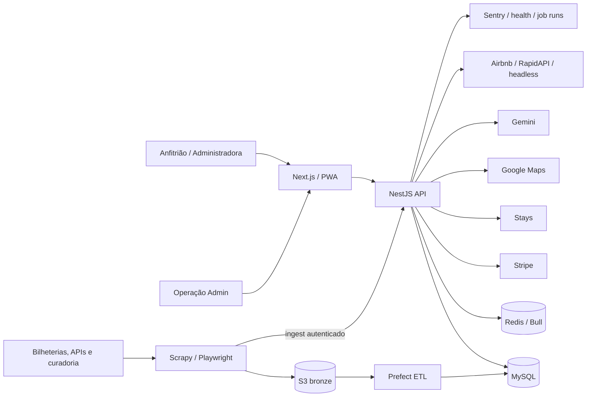
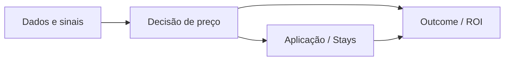
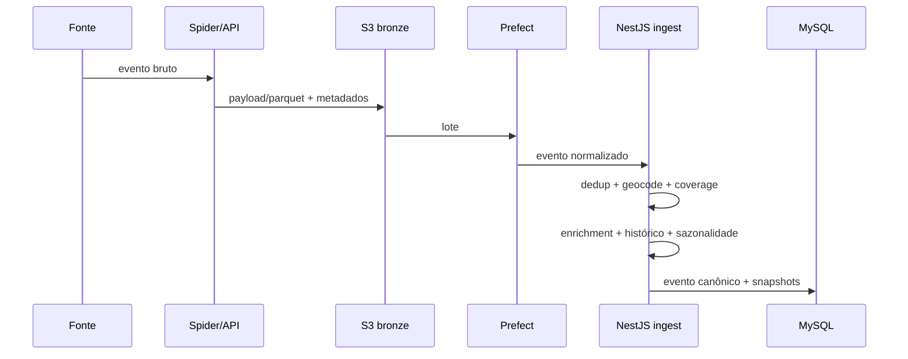
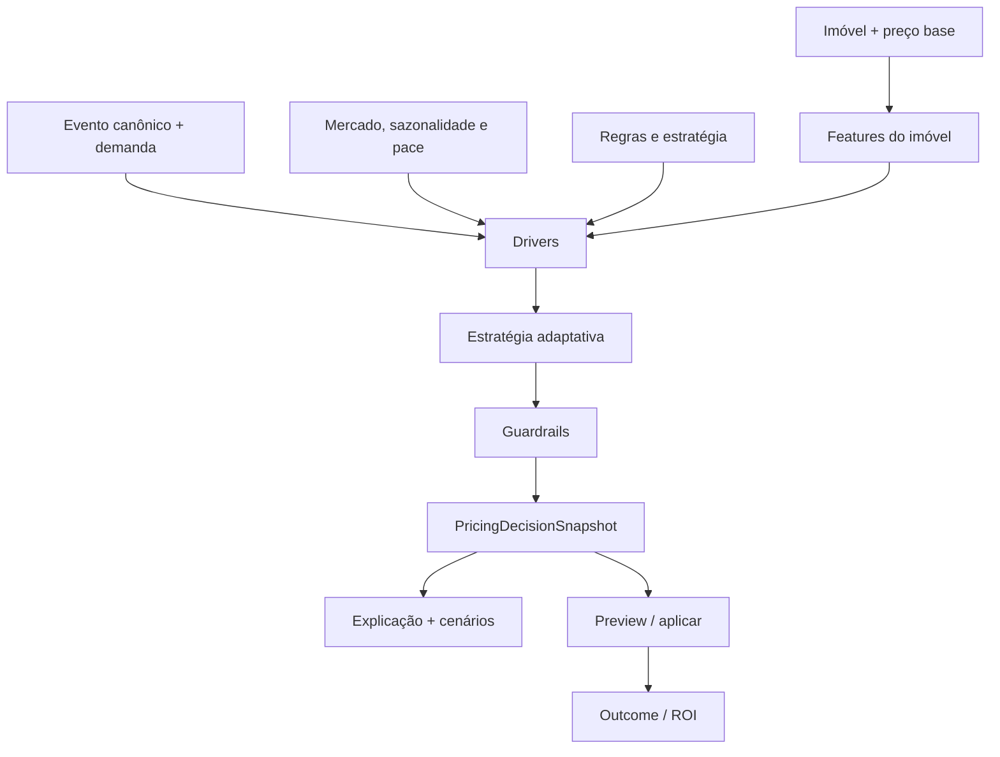
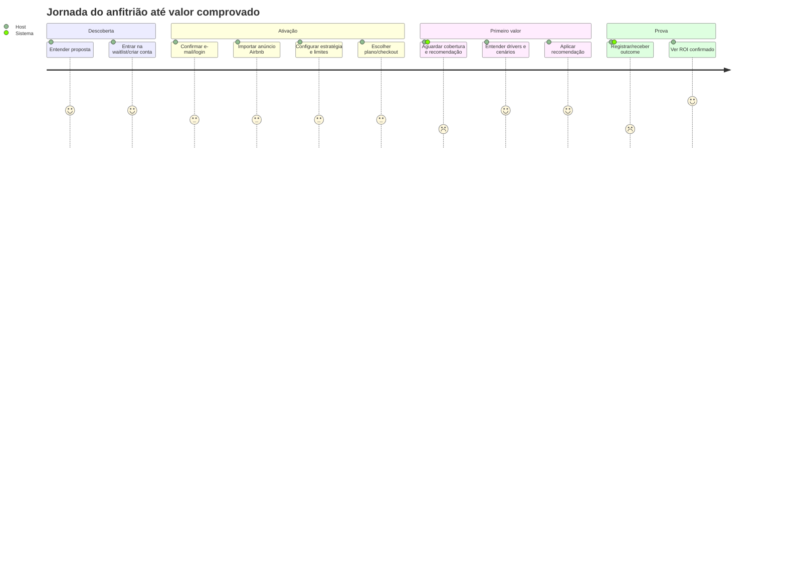

# Auditoria 360° — Arquitetura, Produto, Design System, UI e UX

**Produto:** Urban AI  
**Data da auditoria:** 2026-07-15  
**Escopo:** repositório completo, build local de produção, testes automatizados e probes públicos somente leitura  
**Status:** fotografia verificável do código atual; não substitui métricas reais de produção

> Este é o documento-mãe da auditoria. Ele consolida arquitetura, superfícies, layouts, fluxos, jornadas, responsividade, design system, acessibilidade, atritos, bugs, SWOT e direção de produto. Documentos anteriores continuam úteis como histórico, mas contagens e status abaixo prevalecem quando houver divergência.

---

## 1. Resumo executivo

O Urban AI está em **beta operacional avançado**. A engenharia local está substancialmente pronta: os builds passam, o backend tem cobertura relevante, o pipeline está testado e os fluxos centrais têm E2E. O principal risco já não é “falta de telas”; é a distância entre **código funcionando**, **operação real configurada** e **valor comprovado com outcomes**.

### Veredito

- **Força central:** combinação de radar de demanda, recomendação explicável, guardrails, aplicação auditável e ROI.
- **Maior lacuna de produto:** provar repetidamente a cadeia `sinal → decisão → aplicação → reserva/receita` com dados reais.
- **Maior risco imediato:** artefatos com dados sensíveis continuam presentes no histórico Git; a contenção no HEAD não remove os blobs históricos.
- **Maior risco operacional:** health de readiness inutilizável sem token configurado e domínio de status referenciado na UI sem DNS.
- **Maior bug de UI confirmado:** conteúdo do rodapé autenticado fica parcialmente atrás da bottom-nav no mobile.
- **Maior dívida de frontend:** telas grandes, 3.132 estilos inline, 55 blocos `<style>` e breakpoints fragmentados; o design system existe, mas a governança visual ainda não é uma fonte única completa.
- **Direção recomendada:** interromper expansão lateral por 60–90 dias e operar um beta assistido focado em cobertura, tempo até primeira recomendação, taxa de aplicação e captura de outcome.

### Scorecard

| Dimensão | Nota | Leitura |
|---|---:|---|
| Arquitetura | 8,2/10 | Domínios claros, snapshots auditáveis e guardrails; serviços e integrações ainda formam um sistema operacionalmente complexo. |
| Backend/API | 8,4/10 | 223 endpoints, 45 entidades, 48 migrations e 533 testes no full run final; build, audit e gates estruturais verdes. |
| Dados e IA | 6,3/10 | Scaffolding forte; aprendizagem e ROI ainda dependem de volume e outcomes reais. |
| Frontend funcional | 7,8/10 | 78 telas e 93 E2E definidos; 80 passaram no build local de produção e 13 foram pulados por dependerem de autenticação/staging. |
| Design system | 7,4/10 | Tokens e componentes próprios maduros; ainda há muitos valores e estilos locais fora da camada semântica. |
| UX desktop | 7,8/10 | Navegação e hierarquia fortes; densidade do admin e estados operacionais exigem refinamento. |
| UX mobile | 7,0/10 | Shell, top bar e bottom-nav funcionam; rodapé sobreposto e tabelas/fluxos densos merecem gate recorrente. |
| Acessibilidade | 7,1/10 | Axe público passou; 8 cenários autenticados/admin foram pulados por falta de credenciais E2E. |
| Operação/observabilidade | 5,8/10 | Liveness responde; readiness e status público estão mal configurados, drill real e ações de owner continuam pendentes. |
| Prontidão comercial | 6,4/10 | Produto demonstrável; cobrança, integrações, dados e cases auditados ainda definem a prontidão do beta pago. |
| **Geral** | **7,2/10** | **Bom beta técnico; ainda não é operação comercial autônoma comprovada.** |

---

## 2. Método, evidências e limites

### 2.1 Evidências executadas em 2026-07-15

| Gate | Resultado | Tempo observado |
|---|---|---:|
| Frontend `npm run design:audit` | passou | 10,6 s |
| Frontend `npm run build` | passou sem erro de lint ou tipagem | 76/76 rotas; shared 106 kB Next / 103,0 KiB gzip |
| Backend `npm run build` | passou | 83,1 s |
| Backend Jest | **75 suítes / 533 testes passaram** | 128,4 s no full run final integrado |
| Pipeline Prefect pytest | **55/55 passaram** | inclui qualidade pré-DB e contratos temporais |
| Webscraping pytest | **109/109 passaram** | inclui proveniência e consistência temporal/timezone |
| Frontend Playwright | **64 passaram, 4 falharam, 13 pulados** | 2,2 min |
| Probe `myurbanai.com` | HTTP 200 | 2,1 s |
| Probe `app.myurbanai.com` | HTTP 200 | 1,1 s |
| Backend `/health/live` conhecido | HTTP 200 | 2,1 s |
| Backend `/health` conhecido | HTTP 503 | token de readiness não configurado |
| `status.myurbanai.com` | falhou | DNS não resolve |

### 2.2 O que foi medido

- Estrutura e contagens extraídas do código atual.
- Build e testes executados localmente.
- Layouts inspecionados em evidências Playwright desktop e mobile.
- Disponibilidade pública verificada com requisições GET sem autenticação.
- Tempos sintéticos extraídos da suíte E2E.

### 2.3 O que não foi comprovado

- Conversão, retenção, churn, MRR ou CAC reais.
- Tempo humano médio em produção; as faixas de jornada são estimativas de UX.
- Stripe, Stays, Google Maps, Gemini e Airbnb ponta a ponta com credenciais reais.
- Acessibilidade autenticada/admin: 8 cenários Axe foram pulados sem credenciais E2E.
- Performance Web Vitals em dispositivos e redes reais.
- Efetividade do pricing, MAPE ou lift de receita com amostra estatisticamente válida.

**Regra de leitura:** “teste passou” significa que o contrato do código passou no ambiente auditado; não significa que a integração externa ou o valor de negócio foram comprovados.

---

## 3. Inventário atual do sistema

| Área | Estado atual |
|---|---:|
| Serviços principais | 5: frontend, backend, pipeline, webscraping e KNN legado |
| Frontend | Next.js 15.5, React 19, App Router |
| Telas `page.tsx` | **78** |
| API routes do Next | 2 |
| Componentes React fora de páginas/layouts | **102** |
| Specs Playwright | 25 arquivos / 81 testes listados |
| Backend | NestJS 10/11 toolchain, TypeORM, MySQL |
| Módulos Nest | **32** |
| Controllers | **34** |
| Endpoints HTTP | **223** |
| Entidades TypeORM | **45** |
| Migrations | **48** |
| Specs Jest | **75 suítes / 533 testes** |
| Crons `@Cron` | **21** |
| Spiders Scrapy | **7** |
| Testes pipeline | **55** |
| Testes webscraping | **109** |

### 3.1 Estrutura do monorepo operacional

```text
Urban AI/
├── Urban-front-main/          Next.js: público, host, admin e PWA
├── urban-ai-backend-main/     NestJS: APIs, regras, jobs, billing e integrações
├── urban-pipeline-main/       Prefect: S3 → transformação → MySQL
├── urban-webscraping-main/    Scrapy/Playwright: fontes de eventos
├── urban-ai-knn-main/         microserviço legado, marcado como deprecado
├── dashboard/                 dashboard do Opensquad, não o produto Urban AI
├── docs/                      produto, arquitetura, auditorias, runbooks e evidências
├── load-tests/                k6/smokes de carga
├── scripts/                   gates e evidências de release
├── squads/                    equipes e memória do Opensquad
└── _opensquad/                runtime/configuração do Opensquad
```

### 3.2 Dívida de organização

- O sufixo `-main` nos serviços é resíduo de importação/ZIP e não comunica domínio.
- O microserviço `urban-ai-knn-main` permanece no repo apesar de deprecado.
- `dashboard/` pode ser confundido com o dashboard do produto.
- Há documentação histórica duplicada em Markdown, DOCX e pacotes V2; este documento deve ser o índice de auditoria atual, não uma terceira fonte concorrente de requisitos.

---

## 4. Arquitetura de alto nível



### 4.1 Camadas e responsabilidades

| Camada | Responsabilidade | Contrato crítico |
|---|---|---|
| Aquisição de dados | coletar eventos e sinais externos | preservar fonte, data de coleta e identidade |
| Normalização | limpar, deduplicar, geocodificar e limitar escopo | evento não canônico não vira sinal de preço |
| Inteligência | transformar evento, sazonalidade, imóvel e mercado em drivers | versão de métrica/modelo deve acompanhar o sinal |
| Decisão | gerar preço, cenários, explicação e confiança | toda decisão aplicável precisa de snapshot auditável |
| Aplicação | preview, guardrails, push e rollback | não aplicar fora do guardrail; idempotência obrigatória |
| Resultado | reserva, receita e ROI | separar confirmado, projetado e perdido |
| Experiência | transformar sinais em ação compreensível | mostrar próxima ação, impacto e nível de confiança |

### 4.2 Princípio de dependência



O sentido deve permanecer unidirecional: dados não conhecem aplicação; decisão não depende do canal; ROI é downstream. Isso reduz acoplamento circular e mantém explicabilidade.

---

## 5. Backend e domínios

### 5.1 Concentração de endpoints

| Controller | Endpoints | Risco |
|---|---:|---|
| `admin.controller.ts` | 57 | alto blast radius, muitas responsabilidades operacionais |
| `propriedade.controller.ts` | 23 | núcleo de imóvel/import/preço |
| `auth.controller.ts` | 13 | caminho crítico de aquisição e segurança |
| `email.controller.ts` | 10 | superfície grande para comunicação |
| `waitlist.controller.ts` | 8 | aquisição pré-lançamento |
| maps, host-events, coverage, payments, connect, sugestão e stays | 7 cada | domínios relevantes, tamanhos aceitáveis |

### 5.2 Domínios funcionais

| Domínio | Responsabilidade |
|---|---|
| Auth/User | login, Google, refresh, confirmação, reset, roles e perfil |
| Propriedades/Airbnb/Connect | import, quick info, endereço, inputs, ownership e integrações |
| Eventos/Coverage | ingest, catálogo, dedup, geocode, escopo e fontes |
| Event Intelligence | demanda, impactos por imóvel, blind spots e snapshots |
| KNN/Pricing | features, estratégias, cenários, backtest e feedback |
| Portfolio/Host Panels | agregações, calendário, oportunidades e ações em lote |
| Stays | consentimento, vínculo, preview, push, auto-apply e rollback |
| Billing/Plans | catálogo, checkout, webhook, portal e quota |
| ROI | resultado real/projetado, lift e confiança |
| Communications | e-mail, push, preferências, digests e eventos de comunicação |
| Admin/Ops | dashboard, jobs, auditoria, custos, qualidade e suporte |
| Health/Observability | liveness, readiness, DB, Redis, crons, versão e envs |

### 5.3 Modelo de dados por contexto

**Identidade e acesso:** `User`, `RefreshToken`, `PasswordResetToken`, `EmailConfirmation`, `Waitlist`.

**Imóvel e integração:** `List`, `Address`, `ExternalListing`, `StaysAccount`, `StaysListing`.

**Eventos:** `Event`, `EventSource`, `EventDedupCandidate`, `EventHistoricalMultiplier`, `CoverageRegion`, `AnaliseEnderecoEvento`, `EventIntelligenceSnapshot`, `EventPropertyImpact`, `EventProximityFeature`.

**Pricing e outcomes:** `AnalisePreco`, `PricingDecisionSnapshot`, `PriceUpdate`, `PriceSnapshot`, `PricingInputHistory`, `PricingRuleConfig`, `PortfolioPropertySetting`, `PortfolioDailyPriceOverride`, `OccupancyHistory`, `PricingRecommendationDigest`.

**Portfólio:** `PortfolioActionRun`, `PortfolioActionItem`.

**Operação:** `AdminAuditLog`, `AdminJobRun`, `ProcessStatus`, `AirbnbPricingAttemptLog`, `PlatformCost`.

**Comunicação:** `Notification`, `PushSubscription`, `PushDelivery`, `CommunicationEvent`, `UserCommunicationPreferences`, `AskUrbanMessage`, `ContactSubmission`.

**Billing:** `Plan`, `Payment`.

### 5.4 Evoluções recentes já incorporadas

- `EventHistoricalMultiplier`: âncora histórica e feedback para eventos recorrentes.
- `ExternalListing`: caminho para fontes/listings externos ao fluxo original.
- Feature engineering com metrô, amenidades e categoria.
- Baseline sazonal de feriados/alta temporada.
- Catálogo de capacidade de venues e limite de sell-through.
- Migração de cascade de usuário em pagamentos.
- Catch-up migration para reconstrução do schema core.
- Auto-apply Stays com allowlist, consentimento, dry-run, confidence gate e rollback.

### 5.5 Riscos técnicos do backend

- `admin.service.ts` tem ~2.660 linhas; `propriedade.service.ts`, ~2.404; `event-intelligence.service.ts`, ~2.183; `host-panels.service.ts`, ~1.723.
- 57 endpoints em um controller admin dificultam ownership, autorização granular e revisão.
- 21 crons no mesmo serviço web aumentam dependência do ciclo de vida do container; jobs críticos deveriam ter dead-man's switch e, no longo prazo, workers dedicados.
- Integrações externas estão no caminho crítico do valor; circuit breaker, retry controlado, cache e degradação explícita precisam ser padrão.
- O health de readiness é protegido corretamente no código, mas o token não está configurado no ambiente verificado, tornando o endpoint inutilizável para gates externos.

---

## 6. Fluxos técnicos críticos

### 6.1 Coleta de eventos



**Falhas esperadas:** mudança de layout, captcha, rate limit, fonte stale, geocoding negado, falta de coordenada, falha de enrichment e duplicidade multi-fonte.

**Controles existentes:** retries, dedup hash/candidatos, staleness, Sentry, job runs, escopo geográfico e fontes preservadas.

### 6.2 Recomendação de preço



**Contrato:** preço recomendado sem drivers, confiança, guardrails e versão não é decisão auditável.

### 6.3 Aplicação via Stays

1. Conta conecta com consentimento versionado e token criptografado.
2. Listing é vinculado e recebe modo `inherit`, `notifications` ou `auto`.
3. Preview calcula bloqueios, warnings e limites de aumento/queda.
4. Push usa idempotency key.
5. `PriceUpdate` registra origem, preço anterior e decisão.
6. Rollback referencia a atualização original.
7. Auto-apply exige feature flag, coorte, allowlist, snapshot, confiança mínima, ausência de risk flags e consentimento.

### 6.4 Billing e quota

1. Plano/ciclo/listings definem price e quantity.
2. Checkout Stripe cria sessão.
3. Webhook assinado ativa/atualiza `Payment`.
4. Backend calcula quota por listings contratados e ativos.
5. UI mostra limite, vagas e CTA de upgrade.

### 6.5 Resultado e aprendizagem

1. Host aceita/aplica sugestão.
2. Sistema registra preço aplicado.
3. Ocupação e receita entram por integração ou operação manual.
4. Resultado classifica recomendação.
5. Backtest/feedback ajusta qualidade e histórico.
6. ROI separa valor confirmado de projeção.

**Gargalo:** sem outcome capture consistente, o produto explica decisões, mas não fecha o loop de aprendizagem nem prova lift.

---

## 7. Arquitetura do frontend e informação

### 7.1 Superfícies

| Superfície | Classe raiz | Objetivo | Navegação |
|---|---|---|---|
| Público | `.urban-manifesto` | aquisição, posicionamento, SEO, preços e confiança | header/footer públicos |
| Host | `.urban-app` | decisões diárias, calendário, portfólio, radar e ROI | sidebar desktop; top bar + bottom-nav mobile |
| Admin | `.urban-admin` | operação, qualidade, eventos, billing e suporte | sidebar categorizada + breadcrumb |

### 7.2 Mapa de rotas

```text
Público (14)
├── /
├── /landing, /lancamento, /precos, /sobre, /contato
├── /termos, /privacidade
└── 6 páginas SEO de pricing, eventos, Stays e LGPD

Conta e onboarding (11)
├── /create, /login, /confirm-email/[id]
├── /request-reset-password, /reset-password/[id]
├── /post-login, /onboarding, /onboarding/payment/price
├── /address-verification, /waitlist/aceitar
└── /forbidden

Host (25)
├── /painel, /dashboard
├── /portfolio, /portfolio/history
├── /properties, /properties/[id], /market, /pricing-rules
├── /events, /events/[eventId], /event-radar
├── /near-events, /maps, /event-log
├── /my-roi, /my-plan, /plans, /price
├── /settings/pricing, /integrations, /communications
└── /profile, /notificacao

Admin (28)
├── negócio: resumo, dashboard, finance, funnel, ROI, alpha, contatos, waitlist
├── eventos: radar, eventos, dedup, cadastro, import, cobertura, coletores
├── operação: properties, jobs, stays, users
└── sistema: audit, pricing config, price intelligence, SEO, quality,
             communications e onboarding drip
```

### 7.3 Rotas com atenção

- `/painel` e `/dashboard` não são duplicatas: painel executivo/operacional versus calendário/dashboard de recomendações. A nomenclatura, porém, não deixa essa diferença óbvia.
- `/plans/v2` é alias/redirecionamento e aumenta superfície de manutenção.
- `/price` e `/onboarding/payment/price` são wrappers/rotas de transição; documentar destino canônico.
- `/notificacao` usa singular e português, enquanto o restante mistura inglês e português.

---

## 8. Design system

### 8.1 Estado atual

- **180 declarações de custom properties CSS**.
- Componentes `App*` para host e `Admin*` para operação.
- Escala de spacing baseada em 4/8/12/16/24/32 nos novos primitivos.
- Temas `system`, `light` e `dark` persistidos em `urban-ai-theme`.
- Focus rings globais e suporte parcial a `prefers-reduced-motion`.
- Gate impede bibliotecas de design proibidas e imports antigos.
- Build usa fontes self-hosted via `next/font`.

### 8.2 Tokens

| Grupo | Exemplos |
|---|---|
| Marca | accent `#E8500A`, hover `#FF6A1A`, accent soft/border/shadow |
| Superfícies | background, surface, elevated, muted, nav/sidebar |
| Texto | principal, muted, dim |
| Semântica | success, warning, danger + variantes soft/border |
| Forma | radius card 12, control 10, pill 999 |
| Profundidade | card, elevated e overlay shadows |
| Tipografia | display editorial + Inter para corpo/controle |

### 8.3 Componentes principais

**Host:** `AppButton`, `AppCard`, `AppMetricCard`, `AppBadge`, `AppInput`, `AppSectionHeader`, `AppEmptyState`, `AppLoadingStatus`, `AppConfirmDialog`, `AppToast`, `AppFooter`, `RecommendationCard`, `PortfolioCalendar`, `PaceChart`, `ScenarioComparison`, `AskUrbanDrawer`.

**Admin:** `AdminButton`, `AdminCard`, `AdminMetricCard`, `AdminBadge`, `AdminTable`, `AdminInput`, `AdminSwitch`, `AdminDrawer`, `AdminConfirmDialog`, `AdminToast`, `AdminSectionHeader`, `AdminEmptyState`, `AdminLoadingSkeleton`, `AdminShell`.

**Layout:** `AppStack`, `AppHStack`, `AppVStack`, `AppGrid`.

### 8.4 Gaps de governança

| Achado | Evidência | Impacto |
|---|---:|---|
| Estilos inline | **3.132 ocorrências** | difícil tematizar, testar e refatorar em lote |
| Blocos `<style>` em TSX | **55** | CSS distribuído por páginas/componentes |
| Hex no frontend | 260 ocorrências em 58 arquivos; 49 estão no arquivo de tokens | parte é legítima, mas o restante reduz semântica e rebrandability |
| Breakpoints distintos | 23 expressões de media query | comportamento inconsistente entre telas |
| Storybook/tokens.json | ausentes | design e código não compartilham catálogo executável |
| Componentes gigantes | 20 TSX acima de ~700 linhas | mistura de layout, dados e estado |

### 8.5 Direção do design system

1. Definir tokens primitivos e semânticos em `tokens.json`.
2. Gerar CSS variables a partir dessa fonte.
3. Adotar Storybook ou catálogo interno com estados e viewports.
4. Padronizar breakpoints: `mobile ≤ 767`, `tablet 768–1180`, `desktop ≥ 1181`.
5. Migrar gradualmente estilos inline para variantes de componentes e CSS modules.
6. Transformar o audit em gate de hex fora de allowlist, diálogos nativos, imagens sem fallback e touch targets.

---

## 9. Layouts desktop e mobile

### 9.1 Público desktop

- Layout editorial, alto contraste, títulos display grandes e seções longas.
- Header e footer próprios.
- Bom para posicionamento; headlines de até 140 px tornam a identidade memorável, mas exigem disciplina em páginas utilitárias.
- Primeira carga das rotas públicas fica em ~231–380 kB no build local.

### 9.2 Host desktop

```text
┌──────── sidebar ────────┬──────────────── conteúdo ────────────────┐
│ marca / admin           │ título + contexto + ações               │
│ principal               │ métricas / filtros / cartões            │
│ conta                   │ tabelas / calendário / radar             │
│ tema + perfil           │ footer autenticado                      │
└─────────────────────────┴──────────────────────────────────────────┘
```

- Sidebar persistente a partir de 768 px.
- Conteúdo usa 32 px de padding em desktop.
- Páginas mais densas adotam grids específicos; ainda não há um único container responsivo compartilhado.

### 9.3 Host mobile

```text
┌──────────────────────────────┐
│ marca                  menu  │  top bar
├──────────────────────────────┤
│                              │
│ conteúdo em coluna           │
│ cards / filtros / tabelas    │
│                              │
├──────────────────────────────┤
│ rodapé                       │
├──────────────────────────────┤
│ Painel Calendário Portfólio  │  bottom-nav fixa
│ Radar  Mais                  │
└──────────────────────────────┘
```

- Top bar e bottom-nav são a arquitetura correta para o uso frequente.
- O teste público em 390×844 confirmou ausência de overflow horizontal.
- O shell adiciona padding inferior ao `main`, mas o conteúdo interno do `AppFooter` ainda invade 35,4 px da área da bottom-nav em `/my-plan`.
- Filtros densos precisam priorizar drawer/sheet, não redução excessiva de controles.

### 9.4 Admin

- Sidebar categorizada em Negócio, Motor de eventos, Operações e Sistema.
- Breadcrumb e alternância de tema no topo.
- A navegação já resolve o falso positivo de auditorias antigas que diziam não haver categorias.
- Em mobile, a quantidade de funções exige busca, favoritos/recentes ou navegação por tarefas; replicar todos os 28 links em uma lista longa não escala.

---

## 10. Jornadas de usuário

### 10.1 Jornada principal



### 10.2 Tempos por fluxo

Não há telemetria de tempo humano em produção suficiente para afirmar “média real”. A tabela separa três leituras.

| Fluxo | Faixa humana estimada | E2E sintético local | Média real |
|---|---:|---:|---|
| Waitlist → convite aceito → dashboard | 4–8 min, sem contar espera do e-mail | 10,6 s | não instrumentada |
| Login → roteamento pós-login | 15–45 s | 9,6 s | não instrumentada |
| Importar imóvel Airbnb | 2–6 min; integração pode elevar muito | 12,7 s com mock | não instrumentada |
| Registrar imóvel + configurar motor | 3–7 min | 14,2 s com mock | não instrumentada |
| Escolher plano e iniciar checkout | 2–5 min | 6,0–12,0 s com mock | não instrumentada |
| Primeira recomendação | **meta <48 h** | não representativo | não instrumentada |
| Entender e aceitar recomendação | 30 s–2 min | 4,6–7,5 s | não instrumentada |
| Registrar resultado manual | 1–3 min, dias/semanas depois | incluído em 7,5 s | não instrumentada |
| Conectar Stays | 5–10 min | 6,6 s com mock | não instrumentada |
| Editar preço base/histórico | 1–4 min | 7,6 s | não instrumentada |
| Excluir imóvel | 30–90 s | 6,7 s | não instrumentada |
| Explorar catálogo/radar de eventos | 2–10 min | 6,0–11,9 s | não instrumentada |
| Recuperar senha | 2–5 min + e-mail | 2,5–2,7 s | não instrumentada |
| Carregar página pública | percepção ideal <2,5 s | 1,8–3,3 s por teste | Web Vitals ausentes |

### 10.3 Eventos de telemetria necessários

| Evento | Início | Fim | KPI |
|---|---|---|---|
| `signup_started/completed` | primeiro campo | conta criada | conversão e duração |
| `listing_import_started/completed/failed` | URL submetida | listing persistido | sucesso, erro e p50/p95 |
| `onboarding_started/completed` | primeira etapa | configuração salva | conclusão e drop-off por etapa |
| `checkout_started/completed/failed` | CTA | webhook ativo | conversão e motivo de falha |
| `first_recommendation_eligible/generated/viewed` | listing pronto | card visto | TTFV p50/p90 |
| `recommendation_accepted/applied/rejected` | decisão vista | ação concluída | taxa de confiança/uso |
| `outcome_requested/captured` | evento ocorrido | outcome salvo | capture rate |
| `stays_connect_started/completed/failed` | credenciais/consentimento | conta ativa | integração e duração |

---

## 11. UX: pontos fortes e pontos de atrito

### 11.1 Pontos fortes

- Explicação por drivers, cenários e confiança reduz a sensação de “caixa-preta”.
- Radar transforma dados de eventos em oportunidade, em vez de expor uma lista genérica.
- Guardrails e preview criam confiança antes da automação.
- Portfólio e bulk actions atendem o salto de host casual para profissional.
- Admin já organiza funções por domínio e mostra jobs/readiness.
- Empty state de preparação foi incorporado no `/painel`.
- PWA, offline fallback e bottom-nav aproximam o produto de uma ferramenta operacional diária.

### 11.2 Atritos priorizados

| Prioridade | Atrito | Efeito no usuário | Recomendação |
|---|---|---|---|
| P0 | Histórico Git ainda contém blobs sensíveis | risco de confiança, LGPD e credenciais | concluir resposta ao incidente e expurgo coordenado |
| P1 | Tempo até primeira recomendação não é garantido/medido | host pode concluir que “não funciona” | SLA visual, progresso e TTFV instrumentado |
| P1 | Readiness não configurado | release/monitor não consegue provar prontidão | configurar token e monitor autenticado |
| P1 | Link de status sem DNS | transparência operacional quebrada | publicar status ou remover CTA até existir |
| P1 | Rodapé atrás da bottom-nav mobile | links legais/status parcialmente bloqueados | corrigir espaço e adicionar screenshot gate |
| P1 | Outcome ainda exige disciplina operacional | ROI e aprendizagem incompletos | integração + lembretes + captura simplificada |
| P2 | Imagem de evento quebrada usa alt text cru | aparência de erro e menor confiança | fallback visual com ícone/cor/venue |
| P2 | Cookie banner cobre ações no admin | mascara conteúdo e interfere em testes | banner compacto, bottom sheet ou consentimento prévio no app |
| P2 | Nomes `/painel` e `/dashboard` | modelo mental ambíguo | renomear labels por intenção: “Visão geral” e “Calendário” |
| P2 | Admin muito amplo | carga cognitiva e busca lenta | home por tarefas, favoritos e busca de comando |
| P2 | Erros de integração podem parecer genéricos | usuário não sabe corrigir | taxonomia: credencial, quota, rede, permissão e provedor |
| P3 | Rotas/idiomas mistos | custo de manutenção | definir convenção e aliases canônicos |

---

## 12. Bugs, erros e problemas confirmados

### 12.1 Produto/ambiente

| ID | Sev. | Evidência | Diagnóstico | Ação |
|---|---|---|---|---|
| AUD-001 | P0 | blobs `dump`, `inserts` e e-mails permanecem em `git rev-list --objects --all` | remover do HEAD não apaga histórico/forks/cache | reset/rotação, avaliação LGPD, `git-filter-repo`, force push coordenado e validação |
| AUD-002 | P1 | `/health` = 503; mensagem “Health readiness token is not configured” | env `HEALTH_READINESS_TOKEN`/equivalente ausente em ambiente protegido | configurar token, atualizar gates e monitor |
| AUD-003 | P1 | `status.myurbanai.com` não resolve | `AppFooter` aponta para serviço inexistente | criar status page/DNS ou remover link temporariamente |
| AUD-004 | P1 | build local aponta para host de API cujo `/health/live` retorna 404, enquanto outro host conhecido responde 200 | drift entre URLs de ambiente | definir domínio canônico `api.*`, alinhar Railway/front e eliminar URLs antigas |
| AUD-005 | P1 | footer content bottom 816,39 px; bottom-nav top 780 px | conteúdo do rodapé invade ~35,4 px sob nav fixa | aumentar espaço útil/reorganizar links e criar regressão visual |
| AUD-006 | P2 | cards de `/events` mostram texto alternativo em imagens indisponíveis | `` sem fallback visual de domínio | componente `EventImage` com `onError`, placeholder e aspect ratio |
| AUD-007 | P2 | cookie banner ocupa canto inferior direito sobre admin | modal persistente compete com ações | reduzir, mover para sheet e aceitar consentimento antes do app |
| AUD-008 | P2 | onboarding build warnings em linhas 224, 225 e 593 | imports/aliases mortos | remover ou prefixar somente se intencional |
| AUD-009 | P2 | First Load JS compartilhado 230 kB; onboarding 386 kB, create 380 kB | shell e dependências pesadas no bundle comum | bundle analyzer, dynamic import e redução de dependências compartilhadas |
| AUD-010 | P2 | 3.132 estilos inline e 23 media queries distintas | sistema visual distribuído | tokens/layout primitives/CSS modules e breakpoints canônicos |

### 12.2 Falhas de teste — separar produto de suíte

| Teste | Resultado | Classificação |
|---|---|---|
| Admin Jobs procura `/Ultimos jobs admin/i` | UI renderiza “Últimos jobs admin” corretamente | bug do teste: regex sem acento não casa com texto acessível |
| Event Radar procura `/eventos em sao paulo/i` | UI renderiza “Eventos em São Paulo” corretamente | bug do teste: regex sem acento |
| Tema admin | navegação sem sessão cai em `Network Error` | setup de teste incompleto; mockar `auth/me` e subscription |
| Footer mobile | métrica falha e screenshot confirma sobreposição | bug real de layout |

### 12.3 Cobertura pulada

13 cenários foram pulados: 8 Axe autenticados/admin, 2 smoke mobile autenticados, 2 smoke autenticados e 1 banner de staging. A suíte não deve ser considerada verde enquanto os jobs autenticados não tiverem fixtures/credenciais seguras no CI.

---

## 13. Performance e experiência de desenvolvimento

### 13.1 Bundle

- Shared JS: **230 kB**.
- Rotas mais pesadas na primeira carga: onboarding 386 kB, create 380 kB, home 368 kB, pricing-rules 348 kB, event-radar/my-roi ~343–344 kB.
- Build alerta para strings de 139–189 KiB no cache Webpack.
- Apenas 4 imports de `next/image` versus 16 tags `` encontradas; revisar otimização/fallback caso a caso.

### 13.2 Feedback loop

Uma validação completa local leva vários minutos: frontend build ~6,2 min e backend Jest ~6,6 min nesta máquina/pasta sincronizada. Recomenda-se:

1. gates rápidos por diff em PR;
2. suíte completa assíncrona;
3. cache estável fora de pastas sincronizadas pelo OneDrive;
4. shard de Jest/Playwright em CI;
5. relatório único de duração p50/p95 por gate.

### 13.3 Componentes e serviços grandes

**Frontend:** admin event radar 2.361 linhas, onboarding 2.033, PortfolioCalendar 1.172, properties 1.118, landing 1.077, SideBar 1.065.

**Backend:** admin service 2.660, propriedade service 2.404, event intelligence 2.183, host panels 1.723, event pricing intelligence 1.242.

Critério sugerido: arquivos acima de 800–1.000 linhas entram em plano de extração por responsabilidade quando forem tocados, sem refatoração “big bang”.

---

## 14. Acessibilidade

### 14.1 Evidência positiva

- Axe público passou em home, lançamento e planos.
- Focus rings globais existem.
- Há `aria-label` em controles críticos e 106 ocorrências auditáveis no código.
- 48 `data-testid` suportam testes de regiões complexas.
- Bottom-nav tem labels e ícones.
- `prefers-reduced-motion` está implementado em drawer/toast.

### 14.2 Gaps

- Rotas autenticadas/admin não foram executadas sem credenciais E2E.
- Imagens quebradas preservam alt text, mas o fallback visual é ruim.
- Cookie banner pode alterar ordem de foco e encobrir conteúdo.
- Tabelas densas precisam de alternativa semântica mobile, não apenas scroll.
- Touch targets de 32/40 px atendem WCAG 2.2 AA mínimo de 24 px, mas ficam abaixo da meta interna de conforto de 44 px.

### 14.3 Gate recomendado

Viewports 390×844, 768×1024 e 1440×900; light/dark; teclado; zoom 200%; axe serious/critical; screenshot diff; sem overflow; touch target mínimo 44 px para ações primárias.

---

## 15. SWOT

| Forças | Fraquezas |
|---|---|
| Radar de eventos como input proprietário | valor ainda não comprovado por outcomes suficientes |
| Decisão explicável e auditável | integrações e jobs formam operação complexa |
| Guardrails, preview, idempotência e rollback | frontend com muitos estilos locais e arquivos grandes |
| Produto atende host e administradora | tempo até primeira recomendação não instrumentado |
| Boa base de testes, migrations e runbooks | readiness/status e algumas envs ainda divergentes |
| Portfólio, Stays e ROI fecham narrativa de revenue intelligence | dependência de scraping/APIs externas frágeis |

| Oportunidades | Ameaças |
|---|---|
| Beta assistido com 5–10 hosts para cases auditados | incidente histórico de dados comprometer confiança |
| Dataset `evento → decisão → outcome` como moat | mudanças/anti-bot em fontes externas |
| Administradoras com multi-imóvel e Stays | promessas comerciais antes de prova estatística |
| Captura iCal/Stays para outcomes automáticos | custo e indisponibilidade de Google/Gemini/Airbnb |
| Relatórios explicáveis para proprietários | concorrentes maduros em pricing genérico |
| Market intel e histórico de eventos como diferenciação | expansão de escopo antes de acertar o loop core |

---

## 16. Direcionamento de produto

### 16.1 Posição recomendada

**“Revenue intelligence explicável para hospedagem de curta temporada, alimentada por demanda local e eventos.”**

O diferencial não deve ser “mais um algoritmo de preço”. Deve ser:

1. enxergar demanda local antes do host;
2. explicar por que o preço muda;
3. aplicar com limites e rollback;
4. provar o resultado por driver.

### 16.2 North Star

**Imóveis ativos por semana com decisão auditável aplicada e outcome capturado.**

Essa métrica evita otimizar vaidade: não basta evento coletado, recomendação gerada ou card visto; o ciclo precisa chegar a uma decisão e, depois, a um resultado.

### 16.3 Árvore de métricas

| Etapa | Métrica |
|---|---|
| Cobertura | % de imóveis com eventos/demanda elegível nos próximos 30 dias |
| Ativação | % onboarding concluído; import success rate; checkout completion |
| Valor inicial | TTFV p50/p90; % com primeira recomendação <48 h |
| Confiança | view→accept; rejeição por motivo; expansão de explicação |
| Operação | accept→apply; auto-apply eligible/applied/blocked |
| Prova | outcome capture rate; lift confirmado; MAPE por coorte |
| Retenção | imóveis/hosts ativos semanais; recomendações revisitadas |
| Saúde | fontes frescas; jobs no SLA; readiness; incidentes |

### 16.4 O que não priorizar agora

- Novas verticais fora de hospedagem.
- LLM conversacional amplo antes de contexto, citações e outcomes sólidos.
- Auto-apply em escala antes de beta assistido e rollback exercitado.
- Mais páginas admin sem consolidar tarefas e métricas.
- Rebrand amplo antes de resolver token source-of-truth e instrumentação.

---

## 17. Roadmap recomendado

### 0–7 dias — confiança e operação

1. Concluir ações do incidente Git/LGPD.
2. Configurar token de readiness e monitor autenticado.
3. Publicar `status.myurbanai.com` ou remover o link.
4. Corrigir drift de URL da API.
5. Corrigir rodapé mobile.
6. Corrigir 3 setups/assertions E2E para eliminar falsos vermelhos.
7. Remover warnings de build.

### 8–30 dias — medir o loop

1. Instrumentar funil e tempos descritos na seção 10.3.
2. Dashboard interno de TTFV, apply rate e outcome capture.
3. Fallback de imagem e taxonomia de erros.
4. Rodar Axe autenticado/admin no CI.
5. Bundle analyzer e dynamic imports nas rotas mais pesadas.
6. Definir tokens.json e três breakpoints canônicos.

### 31–60 dias — beta assistido

1. Selecionar 5–10 hosts com cobertura adequada.
2. Garantir onboarding acompanhado e primeira recomendação <48 h.
3. Capturar outcomes semanalmente por integração ou operação assistida.
4. Revisar preço, confiança e motivos de rejeição.
5. Publicar 2–3 cases honestos com amostra e metodologia.

### 61–90 dias — calibração e escala controlada

1. Backtest por cidade, tipo de imóvel e driver.
2. Promover estratégia somente quando gate de qualidade for atendido.
3. Expandir Stays live por allowlist.
4. Automatizar relatórios para host/proprietário.
5. Decidir beta pago com base em TTFV, apply, outcome e suporte.

### Depois de 90 dias

- Mais cidades/fontes conforme cobertura e economics.
- Auto-apply mais amplo, ainda com kill-switch.
- Market intel e pace como drivers calibrados.
- AskUrban com LLM somente se respostas continuarem auditáveis e citadas.
- Avaliar spinoff multi-vertical separadamente.

---

## 18. Backlog priorizado

| Rank | Item | Impacto | Esforço | Owner sugerido |
|---:|---|---|---|---|
| 1 | incidente histórico Git/LGPD | crítico | alto/coordenado | founder + jurídico + segurança |
| 2 | readiness token + monitor | crítico | baixo | DevOps |
| 3 | status page/DNS | alto | baixo | DevOps/produto |
| 4 | URL canônica da API | alto | baixo/médio | DevOps + frontend |
| 5 | footer mobile | alto | baixo | frontend |
| 6 | telemetria TTFV/outcomes | altíssimo | médio | produto + backend + analytics |
| 7 | fixtures E2E autenticadas | alto | médio | QA/frontend |
| 8 | fallback de imagens | médio | baixo | frontend/design |
| 9 | redução do bundle comum | médio | médio | frontend |
| 10 | tokens.json + breakpoints | médio | médio | design/frontend |
| 11 | decompor arquivos gigantes ao tocar | médio | contínuo | engenharia |
| 12 | beta assistido e cases | altíssimo | operacional | produto/founder |

---

## 19. Critérios de prontidão

### Beta assistido

- P0 de segurança com plano formal e contenção validada.
- Front, back, pipeline e E2E críticos verdes.
- Readiness e status operacionais.
- ≥90% dos participantes com recomendação em <48 h.
- Outcome capture ≥60% na coorte.
- Suporte e rollback com owner definido.

### Beta pago

- 2 ciclos de cobrança/renovação sem incidente crítico.
- Integrações externas monitoradas.
- Cases auditados e copy alinhada à evidência.
- MAPE/lift reportados por coorte e amostra.
- Restore drill e rollback Stays exercitados.
- Acessibilidade autenticada/admin sem violações serious/critical conhecidas.

### Go-live controlado

- SLOs e alertas com owner.
- Capacidade/custos por listing conhecidos.
- Runbooks praticados.
- LGPD: retenção, exclusão, consentimento e incident response operacionais.
- North Star e métricas de funil acompanhadas semanalmente.

---

## 20. Conclusão

O Urban AI já ultrapassou a fase de protótipo. O sistema tem profundidade de domínio, segurança transacional no pricing e uma experiência visual coerente o suficiente para beta. A próxima vantagem não virá de adicionar mais telas: virá de **operar o loop completo com poucos clientes, medir tudo, corrigir a prontidão e transformar outcomes em confiança**.

Se a equipe executar apenas cinco coisas agora, devem ser: encerrar o incidente histórico, restaurar observabilidade operacional, corrigir o mobile, instrumentar TTFV/outcomes e rodar o beta assistido. Esse conjunto converte uma base técnica promissora em produto comprovável.

---

## Anexo A — comandos de validação

```bash
# Frontend
npm run design:audit
npm run build
npx playwright test

# Backend
npm run build
npm test -- --runInBand

# Pipeline / scraping
python -m pytest -q
```

## Anexo B — documentos relacionados

- `docs/product/ARCHITECTURE.md`
- `docs/product/DESIGN-SYSTEM.md`
- `docs/product/USER-JOURNEYS.md`
- `docs/product/PRD.md`
- `docs/archive/audits/gaps-reais-atualizados-2026-07.md`
- `docs/postmortems/incident-git-leak-2026-07.md`
- `docs/product/DESIGN-SYSTEM.md`
- `docs/evidence/`
