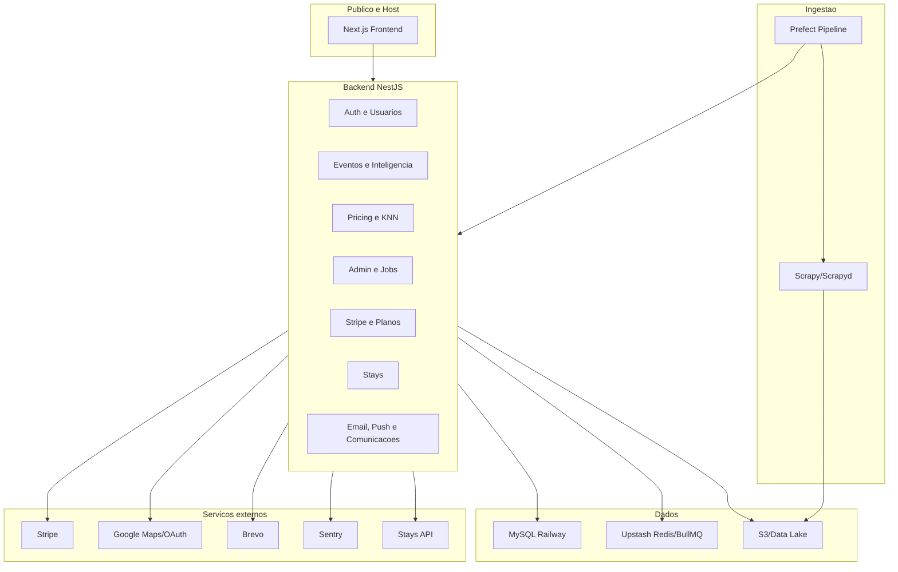
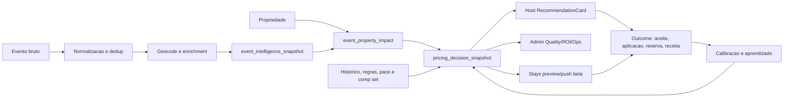

# Arquitetura, Operacao, Runbook e Manutencao V2

Data: 2026-05-24  
Escopo: arquitetura alvo, fluxo de dados, ambientes, release, rotinas operacionais, manutencao e incidentes.

## 1. Principios de arquitetura

1. **Monolito modular antes de microservicos.** O backend NestJS deve continuar centralizando API, auth, pricing, eventos, billing e admin enquanto o time ainda e pequeno.
2. **Dados reais antes de promessa.** Relatorios e narrativa comercial devem separar fato, estimativa e projecao.
3. **Auditabilidade como produto.** Cada recomendacao importante precisa ter origem, versao, confianca, drivers e outcome.
4. **Operacao assistida antes de automacao total.** Stays auto-apply deve ficar em beta controlado ate existir evidencia de seguranca.
5. **Ambientes isolados.** Staging deve ser o gate antes de producao.
6. **Runbook antes de escala.** Toda rotina critica precisa ter dono, gatilho, procedimento e rollback.

## 2. Arquitetura atual

## 3. Arquitetura alvo V2

Objetos centrais:

- `event_intelligence_snapshot`: interpreta evento.
- `event_property_impact`: conecta evento e imovel.
- `pricing_decision_snapshot`: registra decisao de preco.
- `AdminJobRun`: rastreia jobs que alimentam relatorios.
- `PriceUpdate`: registra aplicacao via Stays/manual.
- `OccupancyHistory` e `PriceSnapshot`: base de aprendizagem.

## 4. Ambientes

### Local

Uso:

- desenvolvimento;
- typecheck;
- unit tests;
- e2e com mocks/fixtures;
- dry-run de scripts.

Obrigatorio:

- `.env` local fora do Git;
- nunca usar credenciais reais de producao sem necessidade;
- seeds/fixtures para testes.

### Staging

Uso:

- release gate;
- migrations;
- smoke de Event Radar;
- smoke Stripe test;
- smoke Stays dry-run;
- QA autenticado;
- validacao de runbooks.

Obrigatorio:

- DB isolado de producao;
- URLs próprias;
- secrets próprias;
- dados sinteticos e/ou snapshot mascarado;
- Sentry com ambiente `staging`;
- flags que impedem mutacao externa indevida.

### Production

Uso:

- clientes reais;
- dados reais;
- cobrança;
- monitoramento;
- incident response.

Obrigatorio:

- backups;
- alertas;
- release apenas apos gate;
- rollback conhecido;
- secrets rotacionaveis;
- qualquer mutacao Stays somente com consentimento e controle.

## 5. Fluxo de release

### Antes do merge

Checklist:

- `git status` limpo ou mudancas conhecidas.
- Typecheck frontend.
- Typecheck backend.
- Jest/pytest direcionados conforme area.
- Playwright para rotas afetadas.
- `npm run design:audit` se houver UI.
- Atualizar docs/runbooks se mudou operacao.

### Antes do deploy em staging

Checklist:

- Branch revisada.
- Migrations revisadas.
- Variaveis de staging conferidas.
- Feature flags definidas.
- Plano de rollback.

### Gate staging

Rodar:

- health backend;
- front rotas publicas e autenticadas criticas;
- Event Radar gate;
- smoke de auth;
- smoke de admin;
- smoke de billing em test mode se aplicavel;
- smoke Stays dry-run se aplicavel.

Registrar:

- data;
- branch/SHA;
- ambiente;
- comandos;
- resultado;
- arquivo em `docs/evidence/`.

### Producao

Somente promover quando:

- staging verde;
- backup recente existe;
- rollback definido;
- janela operacional aprovada;
- dono de monitoramento esta disponivel.

## 6. Rotina operacional

### Diaria

| Checagem | Fonte | Acao se falhar |
|---|---|---|
| Backend health | `/health`, `/health/live` | Ver logs Railway e DB |
| Front HTTP 200 | app/landing | Ver deploy frontend |
| Eventos novos | Admin events/collectors | Rodar runbook de webscraping |
| Eventos futuros | Admin Event Radar | Acionar fallback manual se abaixo do alvo |
| Jobs criticos | `/admin/jobs` | Reexecutar ou abrir incidente |
| Sentry | Painel Sentry | Triar erros P0/P1 |
| Stripe | Admin sync-check | Rodar smoke Stripe se divergente |
| Stays beta | Admin Stays | Manter auto-apply desligado se houver duvida |

### Semanal

- Revisar coverage por fonte e cidade.
- Revisar recomendacoes geradas, aceitas e aplicadas.
- Revisar clientes beta e tickets.
- Validar backup/restore dry-run quando houver mudanca de schema.
- Revisar custos de APIs e infraestrutura.
- Atualizar roadmap V2 com bloqueios reais.
- Salvar evidencia de release ou operacao relevante.

### Mensal

- Relatorio executivo para socios.
- Revisao de LGPD, DPAs e canais de suporte.
- Revisao de SLO e incidentes.
- Revisao de custos vs receita.
- Revisao de qualidade do motor.
- Atualizacao do material para investidores se houver marco novo.

## 7. Runbooks principais

| Situacao | Runbook fonte | Observacao V2 |
|---|---|---|
| Release gate | `docs/runbooks/release-gate.md` | Deve apontar para staging real |
| Staging | `docs/runbooks/staging-provisioning.md` | Prioridade P0 |
| Backup/restore | `docs/runbooks/backup-restore.md`, `backup-offsite.md`, `mysql-backup.md` | Executar restore drill real |
| Stripe | `docs/runbooks/stripe-billing-smoke.md` | Obrigatorio antes de beta pago |
| Stays | `docs/runbooks/stays-integration-setup.md`, `stays-beta-private-smoke.md` | Manter default-off/dry-run |
| Webscraping | `docs/runbooks/webscraping-cron-health.md`, `events-ingest-camada1.md` | Service account e freshness |
| Geocoding | `docs/runbooks/backfill-geocoder.md` | Corrigir Google 403 antes de release real |
| LGPD/suporte | `docs/runbooks/suporte-lgpd-beta-pago.md`, `docs/lgpd/` | Confirmar donos |
| Incidentes | `docs/runbooks/incident-response/` | Usar severidade e postmortem |
| WCAG | `docs/runbooks/wcag-audit-checklist.md` | Rodar antes de release maior |

## 8. Incidentes

### Severidade

| Nivel | Exemplos | Resposta |
|---|---|---|
| SEV0 | Vazamento de dados, cobranca errada em massa, auto-apply indevido | Pausar feature, war room, comunicar socios |
| SEV1 | Login fora, backend down, DB down, checkout quebrado | Mitigar em ate 2h uteis |
| SEV2 | Coletores parados, geocoding falhando, jobs criticos atrasados | Mitigar em ate 1 dia util |
| SEV3 | Bug visual, melhoria operacional, inconsistencia nao critica | Backlog priorizado |

### Procedimento padrao

1. Detectar e registrar horario.
2. Classificar severidade.
3. Identificar servico afetado.
4. Pausar feature se houver risco externo.
5. Aplicar runbook especifico.
6. Registrar mitigacao.
7. Comunicar usuarios/socios se necessario.
8. Abrir postmortem para SEV0/SEV1.
9. Atualizar runbook com aprendizado.

## 9. Manutencao tecnica

### Backend

Rotinas:

- Revisar auth/ownership em endpoints legados.
- Remover dependencias e controllers sem uso.
- Garantir migrations idempotentes.
- Cobrir jobs com `AdminJobRun`.
- Modularizar services muito grandes.
- Separar dados reais de estimativas nos DTOs.

Gates:

- `npm run build`
- `tsc --noEmit`
- Jest por dominio afetado
- migration dry-run em staging

### Frontend

Rotinas:

- Consolidar rotas duplicadas.
- Quebrar `service/api.ts` por dominio.
- Manter design system sem bibliotecas novas desnecessarias.
- Garantir empty/error/loading states.
- Testar mobile nas rotas host.
- Usar `RecommendationCard` como padrao de decisao.

Gates:

- `npm run typecheck`
- `npm run build`
- `npm run design:audit`
- Playwright por fluxo afetado

### Pipeline e webscraping

Rotinas:

- Monitorar freshness de fontes.
- Registrar `collectorVersion` e `ingestRunId`.
- Migrar ingestao para service account escopada.
- Validar dedup e geocode.
- Manter fallback manual para eventos estrategicos.

Gates:

- pytest suite oficial;
- smoke collector;
- eventos futuros acima do alvo;
- sem fonte critica stale.

### Dados

Rotinas:

- Verificar crescimento de `PriceSnapshot`, `OccupancyHistory`, `EventProximityFeature`, `EventIntelligenceSnapshot`, `EventPropertyImpact` e `PricingDecisionSnapshot`.
- Validar `generatedAt`, `metricVersion`, `modelVersion`, `confidence`, `sampleSize`.
- Criar data quality checks para datas, geocoding, source e duplicados.

## 10. Monitoramento recomendado

### Tecnico

- Uptime backend e frontend.
- DB health.
- Tempo de resposta API.
- Erros Sentry por release.
- Jobs falhando.
- Deploy status Railway.

### Produto

- Eventos futuros por cidade.
- Fontes ativas.
- Recomendacoes por dia.
- Imoveis com recomendacao futura.
- Recomendacoes abertas, aceitas e aplicadas.
- Usuarios com primeiro valor.

### Negocio

- Waitlist leads.
- Ativacao beta.
- Conversao plano.
- MRR.
- Churn/cancelamento.
- Margem por listing.

### Compliance

- Pedidos LGPD.
- Consentimentos Stays.
- DPAs pendentes.
- Acessos administrativos.
- Logs de auditoria.

## 11. Matriz de donos

| Area | Dono recomendado | Backup |
|---|---|---|
| Produto V2 | Gustavo | Socios |
| Backend/API | Engenharia | Gustavo |
| Frontend/design system | Engenharia frontend | Gustavo |
| Dados/pricing | Engenharia dados | Gustavo |
| Webscraping/pipeline | Engenharia dados | Operacao |
| Billing/Stripe | Gustavo | Financeiro/socios |
| LGPD/privacidade | DPO definido | Gustavo |
| Suporte beta | Operacao | Gustavo |
| Relatorio executivo | Gustavo | Socios |
| Investidores | Socios + Gustavo | Financeiro |

## 12. Checklist de prontidao V2

### Para beta fechado

- [ ] Staging criado e validado.
- [ ] Google Geocoding corrigido.
- [ ] Event Radar recompute em staging.
- [ ] Recomendacoes recentes geradas.
- [ ] Host entende motivo da recomendacao.
- [ ] Captura de preco aplicado pronta.
- [ ] Suporte/LGPD com dono.
- [ ] Material de beta aprovado.

### Para beta pago

- [ ] Stripe KYC.
- [ ] Checkout/webhook/portal/cancelamento/quota testados.
- [ ] Termos/privacidade revisados para beta pago.
- [ ] Canais de suporte reais.
- [ ] Pelo menos 3 cases qualitativos ou quantitativos.
- [ ] Relatorio mensal automatizavel.

### Para auto-apply Stays

- [ ] `STAYS_AUTO_APPLY_ENABLED=false` por default.
- [ ] Dry-run aprovado.
- [ ] Allowlist de usuario/listing.
- [ ] Consentimento registrado.
- [ ] Preview antes de push.
- [ ] Rollback exercitado.
- [ ] Evidencia salva.
- [ ] Comunicação ao host clara.

## 13. Padrao de evidencia

Cada evidencia deve registrar:

- data e hora;
- ambiente;
- branch/SHA;
- comandos executados;
- resultado;
- screenshots/traces quando houver UI;
- impacto;
- bloqueios;
- proxima acao.

Nome sugerido:

`docs/evidence/YYYY-MM-DD-area-descricao.md`

## 14. Proxima acao operacional

1. Criar staging isolado.
2. Corrigir Google Geocoding.
3. Rodar Event Radar contra staging com DB real.
4. Persistir e revisar `pricing_decision_snapshot`.
5. Entrar em beta assistido com poucos hosts e registrar outcomes.
