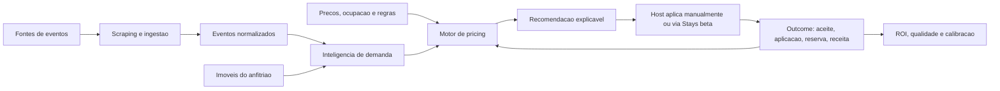

# Mapa Funcional e Tecnico da Urban AI

Data: 2026-05-24  
Base: leitura dos READMEs, documentos recentes e varredura local do codigo.

## Visao geral do produto

A Urban AI e uma plataforma de inteligencia de mercado e pricing para hospedagens de curta temporada. O sistema combina eventos locais, geografia, dados do imovel, historico, regras de preco e sinais de demanda para recomendar acoes ao anfitriao.

Fluxo de valor:

## Repositorios e servicos

| Servico | Pasta | Stack | Funcao |
|---|---|---|---|
| Backend | `urban-ai-backend-main/` | NestJS, TypeORM, MySQL, BullMQ, Stripe, Sentry | API REST, auth, pricing, eventos, admin, Stays, pagamentos, jobs |
| Frontend | `Urban-front-main/` | Next.js 15, React 19, NextAuth, lucide, Playwright | UI publica, host, admin, onboarding, billing, radar e dashboards |
| Pipeline | `urban-pipeline-main/` | Python, Prefect, pandas, SQLAlchemy | Orquestracao de spiders e processamento S3/MySQL |
| Webscraping | `urban-webscraping-main/` | Python, Scrapy, Scrapyd, Playwright | Coleta de eventos em fontes externas |
| KNN legado | `urban-ai-knn-main/` | Node/Express | Aposentado. Logica viva foi migrada para o backend |
| Opensquad interno | `_opensquad/`, `squads/`, `dashboard/` | Agentes, Vite/React | Ferramenta operacional interna, nao parte do produto cliente |

## Mapa de funcionalidades

### 1. Publico e aquisicao

Funcoes atuais:

- Landing e paginas de conteudo.
- Pagina de precos.
- Termos, privacidade e contato.
- Waitlist e convite.
- Conteudo SEO/SGO para temas de precificacao Airbnb e eventos.

Rotas principais:

- `/`
- `/landing`
- `/lancamento`
- `/precos`
- `/sobre`
- `/contato`
- `/termos`
- `/privacidade`
- `/como-precificar-airbnb-em-dias-de-eventos`
- `/precificacao-dinamica-airbnb`
- `/precificacao-por-eventos-sao-paulo`
- `/integracao-stays-precificacao-automatica`
- `/seguranca-lgpd-ia-precificacao`
- `/urban-ai-vs-planilha-de-precificacao`
- `/waitlist/aceitar`

V2:

- Consolidar narrativa sem promessa quantitativa ainda nao comprovada.
- Instrumentar funil com GA4/Pixel/Search Console quando as credenciais reais estiverem prontas.
- Usar conteudo publico para educar mercado e captar beta.

### 2. Autenticacao, onboarding e cadastro de imoveis

Funcoes atuais:

- Cadastro, login, recuperacao de senha e confirmacao de email.
- Onboarding do anfitriao.
- Cadastro/importacao de imoveis.
- Resolucao de CEP/endereco.
- Quota de imoveis por plano.

Rotas principais:

- `/create`
- `/login`
- `/confirm-email/:id`
- `/request-reset-password`
- `/reset-password/:id`
- `/onboarding`
- `/onboarding/payment/price`
- `/address-verification`
- `/post-login`
- `/properties`

V2:

- Reduzir duplicidade entre auth via backend e NextAuth.
- Garantir "time to first value": primeiro imovel completo, primeiro evento relevante, primeira recomendacao.
- Adicionar empty states explicativos quando nao ha cobertura ou dados suficientes.

### 3. Host app

Funcoes atuais:

- Painel do host.
- Dashboard/calendario.
- Portfolio multi-imovel.
- Radar de eventos e eventos proximos.
- Mapa.
- ROI do host.
- Market intelligence por imovel.
- Regras de pricing por imovel.
- Comunicacoes e notificacoes.
- Integracoes Stays.
- Plano e billing.
- AskUrban como assistente operacional.

Rotas principais:

- `/painel`
- `/dashboard`
- `/portfolio`
- `/event-radar`
- `/events`
- `/events/:eventId`
- `/near-events`
- `/near-events/:id`
- `/maps`
- `/my-roi`
- `/my-plan`
- `/notificacao`
- `/settings/communications`
- `/settings/integrations`
- `/properties/:id/market`
- `/properties/:id/pricing-rules`
- `/plans`
- `/plans/v2`
- `/price`

V2:

- Transformar `/painel` em fila de decisoes do dia.
- Transformar `/event-radar` no radar economico central.
- Decidir entre `/dashboard` e `/portfolio` para calendario principal.
- Renomear `/event-log`, que hoje sugere historico de evento mas tende a ser configuracao de pricing.
- Remover ou redirecionar `/maps-bkp`.

### 4. Admin e operacao

Funcoes atuais:

- Overview executivo.
- Dashboard admin.
- Usuarios e propriedades.
- Eventos, deduplicacao, importacao, radar e coverage.
- Saude de coletores.
- Jobs e auditoria.
- Pricing status, qualidade e price intelligence.
- ROI, funil, financeiro e planos.
- Stays, comunicacoes, contatos, waitlist, SEO e alpha.

Rotas principais:

- `/admin`
- `/admin/dashboard`
- `/admin/users`
- `/admin/users/:id`
- `/admin/properties`
- `/admin/properties/:id`
- `/admin/events`
- `/admin/events/new`
- `/admin/events/import`
- `/admin/events/dedup`
- `/admin/event-radar`
- `/admin/collectors-health`
- `/admin/coverage`
- `/admin/jobs`
- `/admin/audit-logs`
- `/admin/price-intelligence`
- `/admin/pricing-config`
- `/admin/quality`
- `/admin/roi`
- `/admin/funnel`
- `/admin/finance`
- `/admin/stays`
- `/admin/communications`
- `/admin/contacts`
- `/admin/waitlist`
- `/admin/onboarding-drip`
- `/admin/seo`
- `/admin/alpha`

V2:

- Separar admin em tres modos: Exec, Ops e Support.
- Exibir impacto financeiro dos alertas, nao apenas status tecnico.
- Conectar cada relatorio a `generatedAt`, `sampleSize`, `confidence`, `metricVersion` e `jobRunId`.
- Tornar `AdminJobRun` e audit trail obrigatorios para mutacoes criticas.

### 5. Eventos e demanda

Funcoes atuais:

- Ingestao de eventos por scraping/API.
- Import CSV/manual.
- Deduplicacao.
- Geocoding e enrichment.
- Event Radar host/admin.
- Heatmap e blind spots.
- Recompute de inteligencia.

Backend relacionado:

- `evento/`
- `event-intelligence/`
- `host-panels/host-events.controller.ts`
- `admin/events/*`
- `maps/`
- `cron/`

V2:

- `event_intelligence_snapshot` como interpretacao versionada do evento.
- `event_property_impact` como impacto por imovel.
- Demand score por evento, potencial de receita e confianca.
- Coverage economica: priorizar fontes por receita potencial, nao so volume.

### 6. Pricing, ROI e aprendizagem

Funcoes atuais:

- Analise de preco e sugestoes.
- KNN/heuristicas dentro do backend.
- Guardrails de preco.
- Regras de pricing por imovel.
- Portfolio actions e simulacoes.
- ROI host/admin.
- Outcomes iniciais via aceite, aplicacao e PriceUpdate/Stays.

Backend relacionado:

- `knn-engine/`
- `propriedades/`
- `sugestao/`
- `roi/`
- `host-panels/`
- `stays/`

V2:

- Criar `pricing_decision_snapshot` como objeto central de decisao.
- Decompor drivers: evento, pace, comp set, sazonalidade, regras e guardrail.
- Mostrar cenarios conservador, recomendado, agressivo e extremo.
- Separar ROI confirmado, projetado e potencial.
- Calibrar probabilidade de absorcao com outcomes reais.

### 7. Monetizacao e integracoes

Funcoes atuais:

- Planos e Stripe checkout.
- Portal de billing.
- Quota por imovel.
- Stripe sync-check admin.
- Integracao Stays com connect, sync listings, preview, push e rollback.
- Brevo/email e push web.

Backend relacionado:

- `payments/`
- `plans/`
- `stays/`
- `email/`
- `mailer/`
- `notifications/`
- `push/`

V2:

- Smoke Stripe completo antes de beta pago.
- Confirmar KYC e Price IDs por ambiente.
- Stays somente em beta assistido com dry-run, allowlist, consentimento e rollback exercitado.
- Adicionar relatorio de "valor perdido por nao aplicar" e "push falho/rejeitado".

## Frontend - mapa de rotas

Varredura local: 75 arquivos `page.tsx`.

### Publicas e marketing

- `/`
- `/landing`
- `/lancamento`
- `/precos`
- `/sobre`
- `/contato`
- `/termos`
- `/privacidade`
- `/como-precificar-airbnb-em-dias-de-eventos`
- `/precificacao-dinamica-airbnb`
- `/precificacao-por-eventos-sao-paulo`
- `/integracao-stays-precificacao-automatica`
- `/seguranca-lgpd-ia-precificacao`
- `/urban-ai-vs-planilha-de-precificacao`

### Auth, conta e onboarding

- `/create`
- `/login`
- `/confirm-email/:id`
- `/request-reset-password`
- `/reset-password/:id`
- `/post-login`
- `/address-verification`
- `/onboarding`
- `/onboarding/payment/price`
- `/forbidden`

### Host

- `/painel`
- `/dashboard`
- `/portfolio`
- `/properties`
- `/properties/:id/market`
- `/properties/:id/pricing-rules`
- `/events`
- `/events/:eventId`
- `/event-radar`
- `/near-events`
- `/near-events/:id`
- `/maps`
- `/maps-bkp`
- `/event-log`
- `/my-roi`
- `/my-plan`
- `/plans`
- `/plans/v2`
- `/price`
- `/notificacao`
- `/settings/communications`
- `/settings/integrations`
- `/waitlist/aceitar`

### Admin

- `/admin`
- `/admin/dashboard`
- `/admin/users`
- `/admin/users/:id`
- `/admin/properties`
- `/admin/properties/:id`
- `/admin/events`
- `/admin/events/new`
- `/admin/events/import`
- `/admin/events/dedup`
- `/admin/event-radar`
- `/admin/collectors-health`
- `/admin/coverage`
- `/admin/jobs`
- `/admin/audit-logs`
- `/admin/price-intelligence`
- `/admin/pricing-config`
- `/admin/quality`
- `/admin/roi`
- `/admin/funnel`
- `/admin/finance`
- `/admin/stays`
- `/admin/communications`
- `/admin/contacts`
- `/admin/waitlist`
- `/admin/onboarding-drip`
- `/admin/seo`
- `/admin/alpha`

## Backend - mapa de modulos e endpoints

Varredura local:

- 32 arquivos `*.module.ts`.
- 34 controllers com endpoints HTTP.
- 215 endpoints HTTP anotados com `@Get`, `@Post`, `@Put`, `@Patch` ou `@Delete`.
- 41 entities TypeORM.
- 40 migrations TypeScript.

### Modulos principais

| Modulo | Responsabilidade |
|---|---|
| `auth` | Registro, login, Google, refresh, logout, perfil e guards |
| `user` | Dados do usuario e verificacoes de conta |
| `connect` | Cadastro de listagens/endereco e integracao inicial Airbnb |
| `propriedades` | Imoveis, dados de pricing, eventos por propriedade e inputs do host |
| `evento` | Eventos, ingestao, importacao, coverage, geocoder |
| `event-intelligence` | Snapshots e inteligencia de demanda |
| `knn-engine` | Pricing engine, estrategias, backtesting e aprendizagem |
| `host-panels` | Pace, portfolio, market intel, AskUrban e host events |
| `admin` | Cockpit admin, jobs, eventos, pricing, ROI, finance, users |
| `admin-properties` | Drill-down admin de propriedades |
| `admin-audit` | Auditoria administrativa |
| `payments` | Stripe checkout, subscription, portal e webhook |
| `plans` | Planos e quotas |
| `stays` | Conta Stays, listings, preview, push, rollback e auto-apply |
| `communications` | Comunicacoes administrativas |
| `communication-preferences` | Opt-in/opt-out do usuario |
| `notifications` | Notificacoes in-app |
| `push` | Web Push/PWA |
| `email` e `mailer` | Email transacional |
| `maps` | Geocoding e processamento de lat/lng |
| `cron` | Jobs agendados |
| `health` | Health/liveness |
| `waitlist` | Captacao e convites |
| `contact-submissions` | Contatos e suporte |
| `dashboard` | Metricas legadas e ROI me |

### Grupos de API

| Grupo | Endpoints principais |
|---|---|
| Health/config | `GET /health`, `GET /health/live`, `GET /public-config` |
| Auth | `POST /auth/register`, `POST /auth/login`, `POST /auth/google`, `POST /auth/refresh`, `POST /auth/logout`, `GET /auth/me`, `GET/PUT /auth/profile` |
| Waitlist | `POST /waitlist`, `GET /waitlist/me`, `GET /waitlist/invite`, `GET /admin/waitlist`, `POST /admin/waitlist/:id/invite` |
| Properties | `GET /propriedades/user`, `GET /propriedades/:id`, `PATCH /propriedades/:id/identity`, `PATCH /propriedades/:id/pricing-inputs`, `GET /properties/:id/market-intel`, `GET /properties/:id/pricing-rules` |
| Events | `GET /event`, `GET /event/all`, `POST /events/ingest`, `POST /events/import-csv`, `GET /events/geocoder/status`, `POST /events/geocoder/run` |
| Host Event Radar | `GET /host/events/catalog`, `GET /host/events/radar`, `GET /host/events/heatmap`, `GET /host/events/:eventId`, `POST /host/events/:eventId/simulate-pricing` |
| Admin Events | `GET /admin/events/analytics`, `GET /admin/events/list`, `GET /admin/events/intelligence`, `GET /admin/events/heatmap`, `GET /admin/events/blind-spots`, `POST /admin/events/:eventId/recompute-intelligence` |
| Dedup | `GET /admin/events/dedup/candidates`, `POST /admin/events/dedup/scan`, `POST /admin/events/dedup/candidates/:id/approve`, `POST /admin/events/dedup/candidates/:id/reject` |
| Pricing | `GET /admin/pricing/status`, `GET /admin/pricing/quality`, `PATCH /sugestoes-preco/:id/aceito`, `PATCH /sugestoes-preco/:id/aplicado`, `PATCH /sugestoes-preco/:id/resultado` |
| Portfolio/Pace | `GET /pace/portfolio`, `GET /portfolio/calendar`, `GET /portfolio/opportunities`, `POST /portfolio/simulate-action`, `POST /portfolio/bulk-action` |
| AskUrban | `GET /ask/usage`, `POST /ask/question`, `POST /ask/feedback` |
| Payments | `POST /payments/create-checkout-session`, `POST /payments/billing-portal-session`, `GET /payments/me`, `DELETE /payments/cancelSubscription`, `POST /payments/webhook` |
| Stays | `POST /stays/connect`, `DELETE /stays/connect`, `POST /stays/listings/sync`, `GET /stays/listings`, `POST /stays/price/preview`, `POST /stays/price/push`, `POST /stays/price/:id/rollback` |
| Admin Ops | `GET /admin/dashboard-summary`, `GET /admin/jobs/runs`, `POST /admin/jobs/geocoder/run`, `GET /admin/audit-logs`, `GET /admin/finance/overview`, `GET /admin/stripe/sync-check` |
| Comunicacoes | `GET /communication-preferences/me`, `PUT /communication-preferences/me`, `GET /admin/communications`, `POST /email/forgot-password`, `GET /notifications/user`, `GET /push/public-key` |

## Dados e entities por dominio

### Usuario e conta

- `user`
- `refresh-token`
- `password-reset-token`
- `waitlist`
- `contact-submission`
- `user-communication-preferences`

### Imoveis e propriedades

- `addresses`
- `list`
- `portfolio-property-setting`
- `portfolio-daily-price-override`
- `portfolio-action-run`
- `portfolio-action-item`

### Eventos e inteligencia

- `events`
- `event-source`
- `coverage-region`
- `event-dedup-candidate`
- `event-intelligence-snapshot`
- `event-property-impact`
- `event-proximity-feature`

### Pricing, ROI e aprendizagem

- `AnaliseEnderecoEvento`
- `price-snapshot`
- `occupancy-history`
- `pricing-input-history`
- `pricing-rule-config`
- `pricing-decision-snapshot`
- `pricing-recommendation-digest`
- `price-update`
- `airbnb-pricing-attempt-log`

### Operacao, auditoria e comunicacoes

- `admin-audit-log`
- `admin-job-run`
- `communication-event`
- `notification`
- `push-subscription`
- `push-delivery`

### Billing e integracoes

- `payment`
- `plan`
- `platform-cost`
- `stays-account`
- `stays-listing`

## Design system

### Componentes host compartilhados

- `AppButton`, `AppCard`, `AppMetricCard`, `AppBadge`, `AppInput`, `AppToast`, `AppPageShell`, `AppSectionHeader`, `RecommendationCard`, `DriverBar`, `ScenarioComparison`, `PaceChart`, `PortfolioCalendar`, `AskUrbanDrawer`, `AskUrbanProvider`, `AppConfirmDialog`, `AppEmptyState`, `SkipLink`, `Icons`.

### Componentes admin

- `AdminShell`, `AdminButton`, `AdminCard`, `AdminMetricCard`, `AdminBadge`, `AdminTable`, `AdminDrawer`, `AdminConfirmDialog`, `AdminToast`, `AdminStatusDot`, `AdminSwitch`, `AdminInput`, `AdminSectionHeader`, `AdminEmptyState`, `AdminLoadingSkeleton`, `Icons`.

### Guardrails vivos

- Publico: `urban-manifesto`.
- Host autenticado: `urban-app`.
- Admin: `urban-admin`.
- Icons: `lucide-react` ou `Icons.tsx`.
- Auditoria: `npm run design:audit`.

## Testes e qualidade

### Frontend

Specs Playwright encontradas:

- smoke publico;
- authenticated smoke;
- mobile authenticated;
- a11y;
- event radar;
- PWA mobile;
- waitlist;
- login/logout/reset;
- onboarding;
- billing;
- Stays;
- properties pricing;
- admin jobs/quality;
- AskUrban entitlement;
- theme preference.

### Backend

- 52 arquivos `*.spec.ts` encontrados.
- Docs recentes registram Jest direcionado verde para Event Radar, pricing, Stays, auto-apply e contratos.

### Webscraping

Testes cobrem auth proxy, base collector, run all, venue collectors, fonte SP Cultura, USP Eventos, Marcha para Jesus, backend client e venue map.

### Load tests

`load-tests/` contem cenarios k6:

- smoke;
- login flow;
- pricing recommendation.

## Decisoes de saneamento V2

| Item | Decisao proposta |
|---|---|
| `/maps-bkp` | Remover ou redirecionar |
| `/event-log` | Renomear para configuracao de pricing ou mover para `/settings/pricing` |
| `/painel` vs `/dashboard` | Definir um como "home operacional" e outro como calendario/analise |
| `/price`, `/plans`, `/plans/v2` | Consolidar fluxo de pricing/plano |
| `api.ts` gigante | Quebrar em clients por dominio: auth, properties, events, pricing, admin, billing, stays |
| Endpoints legados por `usuarioId` | Revisar auth/ownership e migrar consumidores |
| DOCX antigos | Marcar como historicos e gerar V2 revisada |
| Percentuais de roadmap | Usar quatro percentuais: codigo, release, operacao real, valor comprovado |
