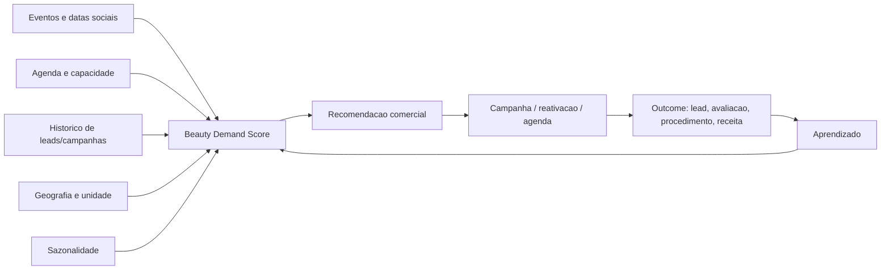

# Previsao de Demanda Beauty com o Motor de Eventos da Urban

Data: 2026-05-24  
Tipo: documento novo, complementar ao pacote V2.  
Pergunta: daria para prever demanda para clinicas/procedimentos esteticos usando o motor de eventos da Urban?

## 1. Resposta curta

Sim, daria. Mas o motor de eventos nao deveria ser usado sozinho.

O motor atual da Urban conseguiria prever **janelas de aumento de intencao** relacionadas a eventos, datas sociais e movimentos locais. Para prever demanda beauty com qualidade, ele precisaria ser combinado com dados internos da clinica:

- agenda;
- leads;
- campanhas;
- historico de conversao;
- no-show;
- ticket medio;
- capacidade;
- procedimento/categoria;
- recompra e manutencao.

Portanto:

> Eventos ajudam a prever quando a demanda pode subir. Dados da clinica dizem quanto essa demanda vira agenda, procedimento e receita.

## 2. O que o motor de eventos ja tem de util

O motor da Urban ja trabalha com uma logica que se encaixa bem em beauty:

| Capacidade atual | Uso em hospedagem | Uso em beauty |
|---|---|---|
| Evento | Show, feira, congresso, jogo | Formatura, casamento, festival, verao, Carnaval, evento social, data comemorativa |
| Data | Noite/periodo da hospedagem | Janela comercial antes da data-alvo |
| Localizacao | Imovel perto do evento | Clinica perto do publico/evento/bairro |
| Impacto | Diaria pode subir | Agenda, campanha e procura podem aumentar |
| Score | Relevancia do evento | Intencao comercial potencial |
| Recomendacao | Ajustar preco/restricao | Rodar campanha, abrir agenda, reativar leads, reforcar equipe |
| Outcome | Reserva/receita | Lead, avaliacao, comparecimento, procedimento, receita |

## 3. O que da para prever bem

### 3.1 Picos de intencao por calendario social

Exemplos:

- verao;
- Carnaval;
- festas de fim de ano;
- formaturas;
- casamentos;
- Dia das Maes;
- Dia dos Namorados;
- Black Friday;
- feriados prolongados;
- grandes eventos sociais, moda, beleza, fitness e lifestyle.

O motor consegue dizer:

- "esta chegando uma janela social forte";
- "esta categoria de campanha deveria comecar antes";
- "essa unidade tem chance de demanda maior";
- "se a agenda estiver ociosa, agora e hora de ativar".

### 3.2 Demanda por bairro/unidade

Se uma clinica tem unidades em bairros diferentes, a Urban pode cruzar:

- densidade de eventos;
- perfil da regiao;
- historico da unidade;
- raio de influencia;
- sazonalidade;
- origem dos leads.

Resultado:

- quais unidades deveriam receber mais campanha;
- onde abrir horario extra;
- onde evitar investimento por baixa conversao.

### 3.3 Timing de campanha

Essa talvez seja a previsao mais valiosa.

Em vez de prever apenas "vai ter demanda", a Urban poderia prever:

> quando a clinica precisa comecar a gerar demanda para nao chegar tarde.

Exemplo:

- para uma data social daqui a 45 dias;
- a clinica define lead time comercial aprovado;
- a Urban recomenda campanha, reativacao e agenda de avaliacao com antecedencia.

### 3.4 Ociosidade futura

Com agenda futura, a Urban pode prever:

- dias com agenda fraca;
- profissionais ociosos;
- salas/equipamentos subutilizados;
- horarios que precisam de campanha;
- risco de campanha gerar demanda sem capacidade.

Aqui o motor de eventos entra como explicacao externa:

- "agenda fraca, mas calendario local forte";
- "agenda cheia, evitar campanha adicional";
- "janela social chegando, abrir slots de avaliacao".

### 3.5 Demanda por categoria comercial

Sem entrar em indicacao clinica, a Urban pode agrupar por categoria:

- procedimentos faciais;
- procedimentos corporais;
- dermatologia estetica;
- odontologia estetica;
- depilacao;
- tratamentos em sessoes;
- avaliacao;
- manutencao/retorno.

A previsao deve ser comercial, nao medica:

- "esta categoria costuma receber mais procura nesse periodo";
- "essa campanha historicamente converte melhor nesta janela";
- "este procedimento tem lead time comercial maior".

## 4. O que nao da para prever com seguranca usando so eventos

Eventos sozinhos nao bastam para prever:

- demanda total da clinica;
- quem deve fazer qual procedimento;
- resultado clinico;
- elegibilidade de paciente;
- taxa real de conversao;
- receita confirmada;
- capacidade operacional real;
- impacto de preco sem historico;
- performance de campanha sem dados de marketing.

Regra:

> evento e sinal de intencao; outcome vem da clinica.

## 5. Modelo conceitual de previsao

## 6. Beauty Demand Score

Criar um score por unidade, periodo e categoria:

| Driver | Exemplo |
|---|---|
| Calendario social | Carnaval, verao, fim de ano, formaturas |
| Eventos locais | moda, beleza, fitness, casamentos, congressos, festas |
| Sazonalidade | meses historicamente fortes/fracos |
| Agenda futura | ocupacao por profissional/sala/equipamento |
| Historico de campanhas | CAC, conversao, receita por canal |
| Lead velocity | aumento de leads recentes |
| No-show risk | comparecimento historico por canal/periodo |
| Retention window | pacientes elegiveis para retorno comercial |
| Capacidade | slots disponiveis e gargalos |
| Geografia | unidade/bairro/raio de influencia |

Saida:

- score 0-100;
- confianca;
- principais drivers;
- acao recomendada;
- risco;
- impacto potencial.

## 7. Recomendacoes possiveis

O motor nao recomendaria tratamento. Ele recomendaria acao comercial/operacional.

| Sinal | Acao recomendada |
|---|---|
| Janela social forte chegando | iniciar campanha aprovada |
| Agenda ociosa nas proximas semanas | reativar leads/pacientes |
| Alta demanda prevista e pouca capacidade | abrir agenda extra ou limitar campanha |
| Muitos leads e baixa conversao | priorizar leads com maior score |
| Evento local relevante perto da unidade | campanha geolocalizada |
| Base antiga elegivel | campanha de manutencao/retorno, se permitida |
| Campanha gerando lead ruim | reduzir verba ou ajustar canal |
| Capacidade cheia | pausar campanha para evitar desperdicio |

## 8. MVP possivel

### MVP 1 - Beauty Demand Brief

Sem integracao profunda.

Entrada:

- cidade/bairro;
- unidade;
- lista de procedimentos/categorias;
- ticket medio;
- agenda futura agregada;
- campanhas ativas;
- calendario local/social.

Saida semanal:

- proximas janelas de demanda;
- categorias com maior oportunidade;
- agenda ociosa;
- campanhas sugeridas;
- risco de capacidade;
- pacientes/leads para reativar;
- ROI estimado/projetado quando houver dados.

### MVP 2 - Agenda Fill Radar

Com dados de agenda.

Entrada:

- slots disponiveis;
- ocupacao por profissional;
- no-show historico;
- leads recentes;
- eventos/datas sociais.

Saida:

- dias com risco de ociosidade;
- dias com risco de excesso;
- sugestao de acao comercial;
- prioridades de contato.

### MVP 3 - Campaign Timing Engine

Com dados de marketing.

Entrada:

- campanhas passadas;
- canal;
- custo;
- leads;
- consultas;
- vendas;
- ticket;
- datas/eventos.

Saida:

- quando iniciar campanha;
- em qual categoria;
- para qual unidade;
- quando pausar;
- qual canal performa melhor;
- ROI por janela.

## 9. Dados minimos para previsao decente

### Sem dados internos

O motor entrega:

- sinais de calendario;
- janelas de oportunidade;
- ideias de campanha;
- inteligencia de bairro/evento.

Confianca: baixa/media.

### Com agenda

O motor entrega:

- ociosidade futura;
- risco de capacidade;
- melhor timing de ativacao;
- prioridade por unidade/profissional.

Confianca: media.

### Com agenda + leads + campanhas

O motor entrega:

- previsao de procura;
- ROI por campanha;
- priorizacao de leads;
- recomendacoes mais precisas.

Confianca: media/alta.

### Com historico longo e outcomes

O motor entrega:

- forecast por categoria;
- cohort de recompra;
- LTV/CAC;
- sazonalidade proprietaria;
- aprendizado por unidade.

Confianca: alta, desde que os dados sejam bons.

## 10. O que reaproveitar da Urban

Reaproveitar quase direto:

- ingestao de eventos;
- normalizacao;
- geocoding;
- coverage por regiao;
- score de relevancia;
- dashboards;
- admin;
- report builder;
- ROI;
- outcome ledger;
- audit logs;
- billing;
- workspaces;
- experiment console.

Adaptar:

- pricing engine -> recommendation engine;
- listing/property -> clinic/unit/procedure/category;
- event-to-property impact -> event-to-clinic/category impact;
- ROI de diaria -> ROI de campanha/procedimento;
- Stays integration -> agenda/CRM/WhatsApp/Meta Ads/Sheets.

Construir novo:

- procedure category model;
- commercial lead time rules;
- agenda fill model;
- lead priority score;
- campaign timing model;
- compliance checklist;
- retention radar.

## 11. Exemplo pratico

Clinica premium na Vila Mariana.

Dados:

- procedimentos faciais e corporais;
- agenda de avaliacao;
- campanhas no Instagram;
- leads via WhatsApp;
- historico simples de venda;
- capacidade de 4 profissionais.

Motor detecta:

- periodo pre-verao chegando;
- eventos sociais e festas nos proximos 60 dias;
- agenda com baixa ocupacao em tardes de terca e quarta;
- leads de campanhas recentes com baixa resposta;
- pacientes antigos sem retorno.

Urban recomenda:

- iniciar campanha educativa aprovada pela clinica;
- priorizar avaliacao em janelas ociosas;
- reativar pacientes antigos com mensagem segura;
- pausar campanha se ocupacao passar de limite;
- medir ROI por canal no final do ciclo.

Resultado medido:

- leads gerados;
- avaliacoes marcadas;
- comparecimento;
- procedimentos fechados;
- receita;
- margem;
- recompra.

## 12. Riscos e guardrails

### Risco regulatorio

A Urban nao deve:

- prometer resultado;
- dizer que um procedimento e indicado para um paciente;
- automatizar campanha sem aprovacao humana;
- manipular antes/depois;
- sugerir comunicacao sem consentimento;
- usar dados sensiveis sem base legal clara.

### Guardrails

- decisao clinica sempre humana;
- recomendacao apenas comercial/operacional;
- logs de aprovacao;
- consentimento para mensagens;
- dados agregados sempre que possivel;
- compliance checklist por campanha;
- separacao entre dado comercial e dado clinico.

## 13. Veredito

Daria para prever demanda beauty com o motor de eventos, sim.

Mas a melhor versao nao e:

> "evento aconteceu, entao venda procedimento X".

A melhor versao e:

> "ha uma janela de demanda chegando; sua agenda/capacidade/historico indicam que esta categoria merece campanha, reativacao ou ajuste operacional agora".

Isso mantem a Urban em um terreno forte, seguro e vendavel:

- inteligencia de demanda;
- planejamento comercial;
- agenda;
- ROI;
- operacao;
- compliance.

Em termos de produto, beauty e uma boa vertical porque o motor de eventos da Urban ja resolveria parte do problema. A parte que faltaria vem dos dados internos da clinica.

