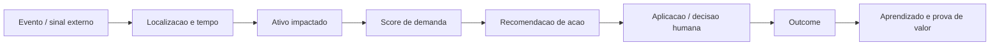

# Roadmap de Funcionalidades Futuras: Core, Expansao e Setores Adjacentes

Data: 2026-05-24  
Tipo: documento novo, complementar aos documentos V2 ja criados.  
Escopo: funcionalidades que eventualmente fazem sentido para (1) o core atual de hosts, propriedades e administradoras, (2) absorcao rapida de novos setores, e (3) setores nao obvios mapeados.

## 1. Tese de produto

A Urban nao deve criar um produto diferente para cada setor. O caminho mais inteligente e construir um nucleo comum de inteligencia urbana e empacotar saidas diferentes por setor.

Nucleo comum:

No core de hospedagem, o "ativo" e um imovel e a acao e mudar diaria, restricao ou minimo de noites.

Em outros setores:

- midia: o ativo pode ser uma campanha, tela, bairro ou inventario OOH;
- staffing: o ativo pode ser uma equipe, cliente, escala ou vendedor;
- estacionamento: o ativo pode ser uma unidade/vaga;
- restaurantes: o ativo pode ser uma loja;
- distribuidores: o ativo pode ser uma rota/carteira;
- real estate: o ativo pode ser um ponto comercial ou microzona.

Portanto, a funcionalidade mais importante de longo prazo e transformar a Urban em um motor de:

> sinal urbano -> impacto por ativo -> acao recomendada -> resultado medido.

## 2. Fontes externas usadas como referencia de mercado

As funcionalidades abaixo se apoiam no que a Urban ja tem e tambem em padroes observaveis em mercados adjacentes.

- PriceLabs documenta dashboards de mercado com ocupacao, ADR, RevPAR, booking window, comp sets, datas futuras de alta demanda e exportacao em PDF.
- Beyond destaca pricing com sinais de demanda, eventos regionais, comp sets, automacao, bulk actions e portfolio management.
- Stays Open API permite operar reservas, calendario, disponibilidade, precos e restricoes, abrindo caminho para integracoes mais profundas.
- ABRAPE mostra que eventos impactam um hub amplo de atividades, nao apenas hospedagem.
- IAB Brasil / IBOPE destacam retail media e DOOH como segmentos relevantes dentro do investimento em publicidade digital.

Links:

- PriceLabs Market Dashboards: https://help.pricelabs.co/portal/en/kb/articles/market-intel-dashboard
- PriceLabs Plans: https://hello.pricelabs.co/plans/
- Beyond Dynamic Pricing: https://beyondpricing.com/products/dynamic-pricing
- Stays Open API: https://academy.stays.net/pt-BR/support/solutions/articles/36000531215-faq-como-funciona-a-api-aberta-da-stays-e-o-que-e-possivel-fazer-com-ela/
- ABRAPE eventos: https://www.abrape.com.br/abrape-preve-r-141-bilhoes-em-consumo-e-forte-expansao-de-empregos-no-setor-de-eventos-em-2025/
- IAB Brasil Digital Adspend 2026: https://iabbrasil.com.br/pesquisa-digital-adspend-2026/

## 3. Funcionalidades fundacionais que destravam tudo

Estas funcionalidades ajudam tanto o core de hosts quanto expansoes futuras. Se a Urban construir isso direito, absorver setores novos fica mais barato.

| Prioridade | Funcionalidade | O que faz | Por que importa |
|---|---|---|---|
| P0 | `Urban Signal Graph` | Liga evento, local, tempo, ativo, impacto, acao e outcome | Vira a base comum para todos os setores |
| P0 | `Demand Impact Score` | Score padrao de impacto por evento/microzona/ativo | Permite comparar oportunidades de setores diferentes |
| P0 | `Action Recommendation Engine` | Recomenda a proxima melhor acao por setor | Tira a Urban do modo dashboard e leva para decisao |
| P0 | `Decision Snapshot` | Grava por que a Urban recomendou algo | Cria auditabilidade e confiança |
| P0 | `Outcome Ledger` | Mede aceite, aplicacao, resultado e feedback | Prova valor e melhora o modelo |
| P0 | `Asset Abstraction` | Trata imovel, loja, estacionamento, tela, rota ou campanha como ativos configuraveis | Evita reescrever produto por setor |
| P0 | `Report/Brief Builder` | Gera PDFs, one-pagers e relatorios por setor | Permite vender antes de construir software completo |
| P0 | `Sector Configuration Layer` | Define nomes, metricas, acoes e templates por vertical | Acelera pilotos e demos |
| P1 | `Partner/API Layer` | Entrega sinais, scores e recomendacoes via API/webhook | Abre PMS, midia, estacionamentos, integradores |
| P1 | `Territory & Geo-Fence Manager` | Define bairros, raios, venues, rotas e areas comerciais | Serve para todos os mercados baseados em localizacao |
| P1 | `Experiment & Pilot Console` | Mede pilotos por setor, cliente e hipotese | Ajuda a decidir onde investir produto |
| P1 | `Data Quality Console` | Mostra cobertura, confianca, duplicidade e fontes | Essencial para vender dados para B2B |

## 4. Funcionalidades para o core atual: hosts, imoveis e administradoras

### 4.1 Decision Inbox do host

Em vez de o usuario entrar em varias telas, a Urban deveria abrir com uma fila de decisoes:

- "subir preco neste imovel por causa deste evento";
- "aumentar minimo de noites neste fim de semana";
- "baixar preco em data sem tracao";
- "corrigir imovel com preco fora do mercado";
- "revisar data com evento relevante e baixa ocupacao";
- "ativar regra de feriado";
- "preencher lacuna entre reservas".

Valor:

- reduz complexidade;
- aumenta time to value;
- gera aceite/rejeicao, que alimenta aprendizado;
- facilita vender para host nao tecnico.

### 4.2 Calendario inteligente com camada de eventos

Funcionalidades:

- calendario por imovel e por portfolio;
- overlay de eventos, feriados, sazonalidade e ocupacao;
- cores por intensidade de demanda;
- comparacao de preco atual vs recomendado;
- marcadores de "datas que merecem acao";
- filtros por bairro, venue, categoria de evento e confianca.

Essa e uma das telas mais importantes da Urban: o usuario precisa "ver dinheiro no calendario".

### 4.3 Portfolio Cockpit para administradoras

Funcionalidades:

- visao multi-imovel;
- agrupamento por regiao, tipo, dormitorio, canal e proprietario;
- bulk actions;
- simulacao de impacto por carteira;
- fila de aprovacoes;
- historico de alteracoes;
- permissoes por equipe.

Isso conversa diretamente com o beachhead de administradoras Stays e PMs.

### 4.4 Cenarios de preco

Cada recomendacao deveria ter cenarios:

- conservador;
- recomendado;
- agressivo;
- extremo;
- nao agir.

Cada cenario deve mostrar:

- diaria sugerida;
- variacao vs preco atual;
- confianca;
- risco;
- potencial de receita;
- motivo principal;
- guardrails ativados.

### 4.5 Recomendacao de restricoes, nao so preco

Mercado maduro nao mexe apenas em diaria. A Urban deve evoluir para:

- minimo de noites;
- restricao de check-in/check-out;
- taxa de limpeza como variavel de estrategia;
- gap nights;
- descontos semanais/mensais;
- preco para hospede extra;
- stay pattern esperado;
- ultima hora vs antecedencia.

Isso aproxima a Urban de revenue management real, nao apenas "aumentar diaria em evento".

### 4.6 Event-to-Property Impact

Para cada evento relevante:

- quais imoveis sao impactados;
- distancia e tempo estimado;
- categoria do evento;
- porte estimado;
- confianca da fonte;
- datas de montagem, evento e desmontagem;
- impacto por noites antes/depois;
- recomendacoes por imovel.

Essa tabela pode virar API, relatorio, dashboard e material executivo.

### 4.7 Prova de ROI por recomendacao

Separar sempre:

- ROI potencial: se a recomendacao fosse aplicada;
- ROI projetado: recomendacao aplicada, mas ainda sem reserva confirmada;
- ROI confirmado: reserva real, receita real, diferenca vs baseline;
- ROI evitado: perda evitada por detectar erro ou subprecificacao.

Sem isso, o produto fica bonito mas dificil de provar.

### 4.8 Stays Beta 2.0

Funcionalidades desejadas:

- sincronizacao de calendario, precos e restricoes;
- leitura de reservas e disponibilidade;
- dry-run antes de aplicar;
- aplicacao manual assistida;
- auto-apply por regra;
- rollback por lote;
- logs por imovel/data;
- alerta quando Stays rejeitar ou divergir;
- relatorio para proprietario.

A Stays Open API torna esse caminho plausivel, especialmente porque expõe calendario, disponibilidade, precos e restricoes.

### 4.9 Owner Report / Investor Report

Para administradoras, uma funcionalidade poderosa seria gerar relatorios para proprietarios:

- o que a Urban detectou;
- quais eventos impactaram o imovel;
- quais decisoes foram tomadas;
- quanto foi capturado ou protegido;
- comparativo com mercado;
- proximas oportunidades.

Isso ajuda a administradora a vender valor para o dono do imovel, nao so para si mesma.

### 4.10 AskUrban contextual

O assistente nao deve ser generico. Ele deveria responder com dados reais:

- "por que esse preco subiu?";
- "quais eventos afetam meus imoveis esta semana?";
- "quais datas estou perdendo dinheiro?";
- "gere uma mensagem para o proprietario explicando a estrategia";
- "monte um plano de preco para os proximos 30 dias";
- "compare meus imoveis da Barra Funda".

### 4.11 Playbooks de revenue management

Templates por estrategia:

- ocupacao primeiro;
- ADR primeiro;
- eventos premium;
- baixa temporada defensiva;
- fim de semana agressivo;
- unidade nova;
- imovel com baixa conversao;
- portfolio profissional.

O usuario escolhe estrategia, e a Urban adapta recomendacoes e guardrails.

### 4.12 Retrospectiva de oportunidade perdida

Uma tela ou relatorio:

- eventos que aconteceram;
- imoveis que poderiam ter sido impactados;
- recomendacoes ignoradas;
- preco real vs preco sugerido;
- reserva ocorrida ou nao;
- estimativa de perda/oportunidade.

Essa funcionalidade e muito boa para vender upgrade e mudar comportamento.

## 5. Funcionalidades para absorver novos setores mais rapido

Estas sao as funcionalidades que fazem a Urban virar uma plataforma expansivel, sem perder foco.

### 5.1 Workspaces por setor

Cada cliente ou piloto pode ter um workspace com:

- setor;
- cidade;
- ativos monitorados;
- acoes possiveis;
- metricas de valor;
- relatorios;
- permissoes;
- plano comercial.

Exemplos:

- workspace de host;
- workspace de midia;
- workspace de staffing;
- workspace de estacionamento;
- workspace de distribuidor.

### 5.2 Cadastro generico de ativos

Em vez de cadastrar apenas imoveis:

| Setor | Ativo |
|---|---|
| Hospedagem | imovel/listing |
| Midia | tela, inventario, bairro, campanha |
| Staffing | cliente, equipe, regiao, oportunidade |
| Estacionamento | unidade, setor, lote, vaga |
| Restaurante | loja |
| Distribuidor | cliente, rota, vendedor, territorio |
| Real estate | ponto, microzona, concorrente |

Campos comuns:

- nome;
- localizacao;
- raio de influencia;
- capacidade;
- horario;
- categoria;
- tags;
- dono/responsavel;
- metricas de negocio;
- dados externos conectados.

### 5.3 Ontologia de acoes

A Urban deve padronizar acoes, mesmo que o texto mude por setor.

| Acao generica | Hospedagem | Midia | Staffing | Restaurante | Estacionamento |
|---|---|---|---|---|---|
| `raise_price` | subir diaria | aumentar CPM/pacote | aumentar proposta | menu/event price | subir preco da vaga |
| `add_capacity` | abrir calendario | reservar inventario | escalar equipe | reforcar equipe | abrir vagas/valet |
| `launch_campaign` | promo para data fraca | campanha/geofence | prospeccao | campanha local | pre-venda |
| `tighten_rules` | minimo de noites | qualificar inventario | exigir margem | limite de reserva | reserva antecipada |
| `contact_lead` | falar com proprietario | abordar marca | abordar evento | abordar parceria | abordar venue |
| `watch_only` | monitorar | monitorar | monitorar | monitorar | monitorar |

Isso e mais importante do que parece. Sem uma ontologia de acoes, cada setor vira um produto diferente.

### 5.4 Builder de relatorios e briefs

Funcionalidade essencial para vender setores novos antes de construir apps inteiros.

Capacidades:

- escolher setor;
- escolher cidade/regiao;
- escolher janela temporal;
- selecionar eventos;
- aplicar template;
- adicionar recomendacoes;
- gerar PDF/HTML;
- versionar relatorio;
- enviar link rastreavel;
- medir abertura, download e resposta.

Templates iniciais:

- Host Opportunity Report;
- Event Media Brief;
- Staffing Demand Radar;
- Parking Demand Brief;
- Location Score Report;
- Event Impact Report.

### 5.5 Demo Generator por setor

Com os mesmos dados, a Urban deveria gerar demos setoriais:

- "veja como isso parece para uma agencia de midia";
- "veja como isso parece para uma empresa de seguranca";
- "veja como isso parece para um estacionamento";
- "veja como isso parece para uma administradora".

Isso ajuda muito em vendas e captação.

### 5.6 API e webhooks de sinais

Endpoints futuros:

- eventos por regiao;
- score de demanda por ativo;
- recomendacoes por ativo;
- webhooks de novos eventos relevantes;
- feed de oportunidades;
- historico de outcomes;
- status de qualidade da fonte.

Exemplo de produtos:

- `Urban Events API`;
- `Urban Demand Score API`;
- `Urban Recommendations API`;
- `Urban Reports API`.

### 5.7 Importador universal

Para piloto rapido, o melhor conector e quase sempre CSV/Google Sheets antes de API.

Importar:

- lista de unidades;
- lista de clientes;
- rotas;
- inventario;
- historico de vendas;
- reservas;
- precos;
- capacidade;
- campanhas.

Depois, quando o setor provar valor, construir integracao nativa.

### 5.8 CRM leve de oportunidades

Para mercados como staffing, distribuidores, midia e ativacao, a Urban nao deve apenas mostrar eventos. Deve dizer "quem abordar".

Funcionalidades:

- lista de leads por evento;
- status de abordagem;
- responsavel;
- proxima acao;
- potencial estimado;
- notas;
- exportacao;
- webhook para HubSpot/Pipedrive/Sheets.

### 5.9 Planos comerciais modulares

Para nao travar monetizacao:

- SaaS por ativo;
- assinatura por cidade;
- relatorio premium;
- API usage;
- pacote por campanha/evento;
- conta enterprise;
- success fee quando houver revenue tracking.

## 6. Funcionalidades para setores nao obvios

### 6.1 Midia OOH/DOOH, retail media e geofencing

Funcionalidades:

- Event Media Planner;
- score de oportunidade por evento;
- mapa de bairros e venues com maior intensidade;
- calendario de campanhas por data;
- filtros por categoria de evento;
- sugestao de marcas/setores com fit;
- exportacao para plano de midia;
- geofence exportavel;
- sobreposicao com inventario de telas/pontos;
- comparativo antes/depois de campanhas;
- recap pos-evento para cliente/marca.

MVP:

- relatorio semanal Sao Paulo;
- top 20 eventos;
- top 10 regioes;
- recomendacoes por categoria de marca;
- PDF executivo.

Por que ajuda a absorver rapido:

- nao exige mudar o core;
- vende insight e planejamento;
- pode comecar como relatorio premium.

### 6.2 Agencias de ativacao, patrocinio e live marketing

Funcionalidades:

- brand-event matchmaker;
- ranking de eventos por categoria de marca;
- calendario de oportunidades de patrocinio;
- gerador de pitch;
- mapa de eventos concorrentes;
- estimativa de janela de ativacao;
- banco de venues e produtores;
- recap para patrocinador.

MVP:

- "onde uma marca deveria estar nos proximos 60 dias";
- 5 perfis de marca: bebidas, tecnologia, moda, mobilidade, turismo;
- PDF com narrativa e mapa.

### 6.3 Staffing, seguranca, limpeza e facilities

Funcionalidades:

- Operations Demand Radar;
- estimador de demanda de equipe por evento;
- calendario de escala por regiao;
- leads de eventos para time comercial;
- alerta de pico;
- recomendacao de capacidade;
- modelo de proposta por evento;
- exportacao para vendedor/gestor;
- indicador de margem/potencial.

MVP:

- relatorio semanal de eventos que merecem abordagem;
- classificacao por tipo de servico provavel;
- mapa por bairro;
- lista de contatos/venues quando disponivel.

### 6.4 Estacionamentos, valets e mobilidade local

Funcionalidades:

- Parking Demand Radar;
- score de lotacao esperada por unidade;
- recomendacao de preco/faixa;
- alerta de reforco de equipe;
- calendario de pre-venda;
- landing page por evento/unidade;
- integracao futura com plataforma de reserva;
- relatorio de datas subprecificadas.

MVP:

- cadastrar 10 estacionamentos manualmente;
- cruzar com eventos proximos;
- gerar recomendacao de preco e equipe por semana.

### 6.5 Restaurantes, bares, food halls e franquias

Funcionalidades:

- Store Demand Calendar;
- impacto por loja;
- alerta de estoque e equipe;
- recomendacao de campanha local;
- sugestao de horario estendido;
- alerta de delivery/retirada;
- ranking de eventos por potencial de consumo;
- relatorio para gerente regional.

MVP:

- focar em grupos e food halls, nao restaurante isolado;
- mapa de eventos por unidade;
- alerta semanal com acoes simples.

### 6.6 Distribuidores, bebidas e foodservice B2B

Funcionalidades:

- mapa de pre-venda por evento;
- sugestao de clientes para abordar;
- recomendacao de SKU por tipo de evento;
- planejamento de rota;
- territorio por vendedor;
- alerta de bairro com pico;
- integracao futura com ERP/CRM;
- outcome por pedido gerado.

MVP:

- importar carteira de clientes via planilha;
- cruzar clientes com eventos proximos;
- gerar "lista de abordagem da semana" para vendedores.

### 6.7 Real estate comercial e site selection

Funcionalidades:

- Urban Location Score;
- indice de recorrencia de eventos;
- demanda por microzona;
- comparativo de pontos;
- mapa de venues relevantes;
- risco de sazonalidade;
- sugestao de tipo de negocio por local;
- relatorio de decisao para investidores/franqueadoras.

MVP:

- relatorio premium por bairro;
- ranking de microzonas;
- explicar que e uma camada de eventos/demanda, nao uma avaliacao imobiliaria completa.

### 6.8 Turismo corporativo e procurement

Funcionalidades:

- city compression calendar;
- alerta de datas caras;
- recomendacao de antecedencia de reserva;
- monitoramento de cidades frequentes;
- API para TMC/agencia;
- relatorio de risco de indisponibilidade.

MVP:

- calendario de 90 dias para Sao Paulo e Rio;
- datas com evento + risco de compressao;
- recomendacao de compra antecipada.

### 6.9 Organizadores, venues e centros de convencao

Funcionalidades:

- Event Impact Report;
- mapa de impacto em hospedagem, midia, estacionamento e comercio;
- calendario competitivo;
- prova para patrocinadores;
- relatorio pos-evento;
- benchmark com eventos similares;
- mapa de oportunidades para expositores.

MVP:

- relatorio de impacto para 1 venue ou 1 evento;
- versao PDF executiva para patrocinador.

### 6.10 Turismo, entidades e desenvolvimento economico

Funcionalidades:

- radar economico da cidade;
- eventos por impacto potencial;
- bairros beneficiados;
- lacunas de calendario;
- indicador de atratividade;
- relatorio mensal para entidade;
- mapa de oportunidades de captacao de eventos.

MVP:

- painel/relatorio de Sao Paulo como vitrine institucional;
- nao depender de venda publica no inicio.

### 6.11 Seguros, risco urbano e compliance

Funcionalidades futuras:

- crowd risk score;
- exposicao por carteira;
- alertas de concentracao;
- trilha auditavel de sinais;
- relatorio de risco por evento/microzona.

Condicao para entrar:

- historico de incidentes, sinistros ou parceiro de dados.

### 6.12 Telecom e conectividade

Funcionalidades futuras:

- forecast de carga por regiao;
- eventos por cobertura de antena;
- alertas de alta concentracao;
- API para planejamento operacional.

Condicao para entrar:

- parceiro enterprise ou integrador.

### 6.13 Fintech, credito e underwriting

Funcionalidades futuras:

- sinal de demanda futura;
- score de oportunidade por negocio/local;
- monitoramento de carteira;
- relatorio para credito/antecipacao.

Condicao para entrar:

- outcomes historicos robustos e governanca de dados.

## 7. Matriz esforco x impacto

| Funcionalidade | Impacto | Esforco | Horizonte | Observacao |
|---|---:|---:|---|---|
| Decision Inbox | 5 | 3 | 0-60 dias | Fortalece core e gera aprendizado |
| Demand Impact Score v1 | 5 | 3 | 0-60 dias | Base comum de todos os produtos |
| Report/Brief Builder | 5 | 3 | 0-60 dias | Vende setores novos sem app completo |
| Outcome Ledger | 5 | 4 | 0-90 dias | Prova valor e moat |
| Event-to-Property Impact | 5 | 3 | 0-90 dias | Core da narrativa de hospedagem |
| Portfolio Cockpit | 5 | 4 | 60-120 dias | Essencial para administradoras |
| Stays Beta 2.0 | 5 | 4 | 60-120 dias | Aumenta valor e dados reais |
| Asset Abstraction | 5 | 4 | 60-120 dias | Destrava multiplos setores |
| Sector Configuration Layer | 4 | 3 | 60-120 dias | Acelera pilotos |
| API/Webhooks | 5 | 4 | 90-180 dias | Abre parcerias e data products |
| Media Planner | 4 | 3 | 30-90 dias | Melhor setor nao obvio inicial |
| Staffing Radar | 4 | 2 | 30-90 dias | Simples de testar |
| Parking Radar | 4 | 3 | 60-120 dias | Boa ponte com dynamic pricing |
| Location Score | 4 | 4 | 120-180 dias | Alto ticket, exige dados extras |
| Insurance/Telecom/Credit Scores | 5 | 5 | 180+ dias | Guardar como opcao futura |

## 8. O que eu faria primeiro

### Sprint estrategica 1 - Core que tambem vende expansao

Construir ou especificar:

1. `Demand Impact Score v1`
2. `Decision Snapshot`
3. `Decision Inbox`
4. `Report/Brief Builder`
5. `Outcome Ledger`

Por que:

- fortalece o produto de hosts;
- gera prova de valor;
- cria base para documentos de investidores;
- permite testar midia/staffing/parking sem construir apps inteiros.

### Sprint estrategica 2 - Pilotos setoriais com baixo codigo

Criar tres demos com o Report/Brief Builder:

1. Host Opportunity Report
2. Urban Event Media Brief
3. Staffing Demand Radar

Objetivo:

- validar disposicao a pagar;
- entender linguagem de cada comprador;
- descobrir quais dados faltam;
- nao comprometer engenharia com setor errado.

### Sprint estrategica 3 - Plataforma expansivel

Se algum piloto tracionar:

1. Asset Abstraction;
2. Sector Configuration Layer;
3. API/Webhooks;
4. workspace por setor;
5. planos comerciais modulares.

## 9. Novas rotas e modulos sugeridos

### Frontend

Core hosts:

- `/decisions`
- `/calendar`
- `/portfolio/actions`
- `/reports/owner`
- `/reports/opportunities`
- `/settings/guardrails`
- `/stays/sync`

Expansao:

- `/workspaces`
- `/workspaces/:id`
- `/briefs`
- `/briefs/new`
- `/media-planner`
- `/operations-radar`
- `/parking-radar`
- `/location-score`
- `/api-keys`

Admin:

- `/admin/signals`
- `/admin/demand-scores`
- `/admin/sectors`
- `/admin/briefs`
- `/admin/api-usage`
- `/admin/outcomes`
- `/admin/experiments`

### Backend

Modulos novos ou evoluidos:

- `demand-signals`
- `demand-scores`
- `decision-snapshots`
- `action-recommendations`
- `outcome-ledger`
- `asset-registry`
- `sector-workspaces`
- `brief-builder`
- `data-products`
- `partner-api`
- `experiments`

Entidades conceituais:

- `DemandSignal`
- `DemandImpactScore`
- `BusinessAsset`
- `SectorWorkspace`
- `ActionRecommendation`
- `DecisionSnapshot`
- `OutcomeRecord`
- `BriefTemplate`
- `GeneratedBrief`
- `ApiConsumer`
- `WebhookSubscription`

## 10. Guardrails: o que nao construir agora

Evitar no curto prazo:

- app B2C de eventos;
- POS de restaurante;
- ERP para distribuidor;
- sistema completo de escala de funcionarios;
- dashboard municipal completo;
- score de seguro/credito sem dados historicos;
- telecom enterprise sem parceiro;
- integracao nativa para cada setor antes de vender relatorio/piloto.

A regra:

> Se o setor ainda nao provou demanda, vender relatorio/brief. Se provar recorrencia, construir workspace. Se provar escala, abrir API.

## 11. Resumo executivo

As funcionalidades mais importantes para a Urban nao sao apenas "mais telas". Sao capacidades reutilizaveis:

1. saber qual sinal urbano importa;
2. saber quais ativos sao impactados;
3. recomendar uma acao;
4. explicar a recomendacao;
5. medir o resultado;
6. transformar isso em relatorio, API ou automacao.

Para o core atual, as melhores apostas sao:

- Decision Inbox;
- calendario inteligente com eventos;
- Portfolio Cockpit;
- Stays Beta 2.0;
- ROI por recomendacao;
- owner/investor reports.

Para absorver novos setores mais rapido, as melhores apostas sao:

- Asset Abstraction;
- Sector Workspaces;
- Report/Brief Builder;
- Demand Impact Score;
- API/Webhooks;
- Importador universal.

Para setores nao obvios, as melhores apostas sao:

- Event Media Planner;
- Staffing Demand Radar;
- Parking Demand Radar;
- Distribuidor/Foodservice Pre-Sales Radar;
- Urban Location Score.

Conclusao:

A Urban deve evoluir de "ferramenta de pricing para hosts" para "sistema de inteligencia de demanda urbana". Mas a execucao deve continuar disciplinada: primeiro provar valor em hospedagem, depois vender briefs setoriais, depois transformar os vencedores em produtos.

