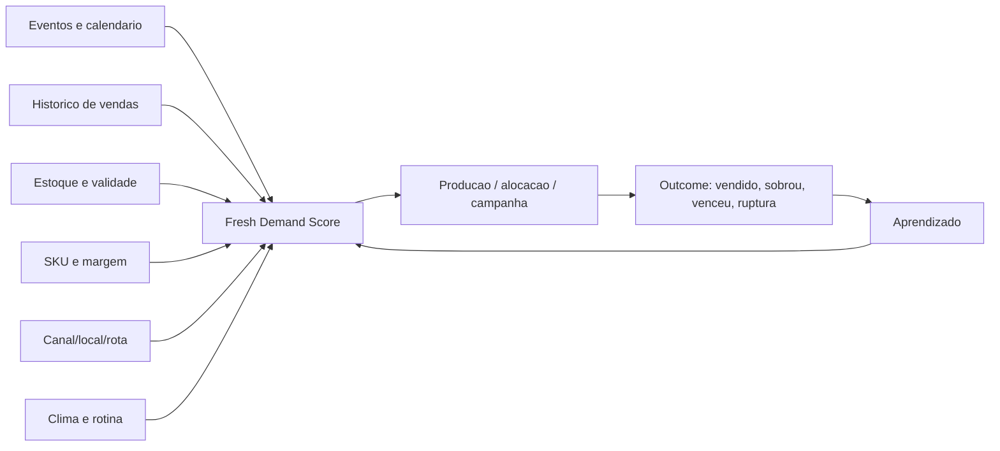

# Vertical: Comida Ultraresfriada, Refeicoes Prontas e Cadeia Fria

Data: 2026-05-24  
Tipo: documento novo, complementar ao pacote V2.  
Objetivo: avaliar como a Urban AI poderia atender empresas de comida ultraresfriada/refrigerada, refeicoes prontas, marmitas premium, comida saudavel, foodservice B2B e varejo de conveniencia.

## 1. Tese rapida

Comida ultraresfriada e uma vertical muito interessante para a Urban porque combina quatro elementos que o motor de demanda consegue atacar bem:

1. demanda local variavel;
2. validade curta;
3. producao e distribuicao antecipadas;
4. custo alto de ruptura e desperdicio.

Em hospedagem, a Urban tenta evitar diaria subprecificada ou calendario mal aproveitado.

Em comida ultraresfriada, a Urban poderia evitar:

- produzir demais e perder produto por validade;
- produzir de menos e perder venda;
- mandar estoque para o ponto errado;
- ativar campanha sem capacidade;
- errar mix por bairro, canal, clima, evento ou rotina;
- nao reagir a picos locais de consumo.

A tese:

> A Urban pode transformar eventos, rotina urbana, geografia, clima, canais de venda e historico de consumo em previsao de producao, mix, estoque e distribuicao para alimentos refrigerados de curta validade.

## 2. Proposta de valor

### Frase curta

A Urban ajuda empresas de comida ultraresfriada a produzir, distribuir e vender a quantidade certa, no lugar certo, antes que o produto vire desperdicio.

### Frase comercial

A Urban combina demanda local, eventos, historico de vendas, validade, estoque, campanhas e canais de distribuicao para recomendar quanto produzir, para onde enviar, quais SKUs priorizar e quando ativar vendas.

### Frase para investidor

A Urban pode aplicar sua inteligencia de demanda urbana a categorias pereciveis de alto giro, onde previsao granular reduz desperdicio, melhora margem e aumenta disponibilidade no ponto de venda.

## 3. Dor principal do setor

Empresas de comida ultraresfriada vivem um equilibrio dificil:

> se produzem demais, jogam margem fora; se produzem de menos, perdem venda e cliente.

### Dores praticas

| Dor | Como aparece | Consequencia |
|---|---|---|
| Validade curta | Produto tem poucos dias uteis para venda | Perda, markdown ou descarte |
| Ruptura | Produto acaba em pontos/canais com demanda | Venda perdida e cliente migra |
| Mix errado | SKU saudavel, proteico, executivo ou familiar vai para canal errado | Estoque parado e perda de giro |
| Planejamento manual | Produção baseada em media simples ou feeling | Erro recorrente por bairro/canal |
| Distribuicao cega | Envio igual para lojas diferentes | Uma loja sobra, outra falta |
| Eventos e picos locais | Shows, feiras, academias, corporativo e fluxo mudam consumo | Demanda nao capturada |
| Campanha sem estoque | Marketing gera pedido sem produto certo | Frustracao e custo de midia perdido |
| Estoque sem campanha | Produto perto do vencimento nao recebe acao a tempo | Desperdicio |
| Falta de visibilidade de margem | Decisao foca volume, nao lucro/validade | Cresce receita mas perde margem |
| Cadeia fria | Qualidade depende de processo, transporte e armazenamento | Risco operacional e sanitario |

## 4. Como os ativos da Urban se traduzem

| Ativo Urban hoje | Traducao para comida ultraresfriada |
|---|---|
| Eventos da cidade | Picos de consumo por shows, feiras, corporativo, esporte, turismo e fluxo |
| Geografia por imovel | Geografia por loja, dark kitchen, ponto de retirada, geladeira, cliente B2B ou rota |
| Pricing/recommendation engine | Recomendacao de producao, distribuicao, campanha, markdown e mix |
| Event Radar | Demand Radar por regiao/canal/SKU |
| Portfolio | Multiunidade, multicidade, multicanal, multirota |
| ROI | Margem capturada, desperdicio evitado, ruptura evitada, sell-through |
| Outcome Ledger | Produzido, enviado, vendido, sobrou, venceu, teve markdown |
| Report Builder | Relatorio para operacao, compras, producao, comercial e diretoria |
| Admin operacional | Controle de fontes, jobs, qualidade, alertas e auditoria |

## 5. Produto possivel: Urban Fresh Demand OS

### Modulos

| Modulo | O que faz |
|---|---|
| Fresh Demand Forecast | Preve demanda por SKU/canal/local/data |
| Production Planner | Recomenda quanto produzir por lote/SKU/janela |
| Allocation Engine | Recomenda para onde enviar estoque |
| Shelf-Life Risk Radar | Detecta risco de vencimento e sugere acao |
| Rupture Risk Radar | Detecta risco de faltar produto em ponto/canal |
| Event & Routine Demand Layer | Cruza eventos, rotina urbana, corporativo, clima e calendario |
| Campaign Trigger Engine | Sugere campanha/markdown quando estoque e validade pedem |
| Route & Replenishment Planner | Ajuda reposicao por rota/ponto |
| B2B Account Demand Radar | Preve demanda por cliente corporativo, academia, mercado ou loja |
| Margin & Waste Board | Mostra margem, desperdicio, sell-through e ruptura evitada |

## 6. Segmentos possiveis

| Segmento | Fit | Por que |
|---|---:|---|
| Marmitas saudaveis premium | Alto | Assinatura, recorrencia, demanda por rotina e campanha |
| Refeicoes prontas refrigeradas para varejo | Alto | Mix, validade, loja e ruptura sao dores fortes |
| Dark kitchens com comida refrigerada | Alto | Producao central + canais digitais + validade |
| Geladeiras inteligentes em empresas/academias | Muito alto | Reposicao por ponto, sell-through e validade |
| Foodservice B2B corporativo | Alto | Demanda por cliente, calendario corporativo e eventos |
| Kits de refeicao/meal prep | Alto | Planejamento semanal e mix |
| Produtos proteicos/fitness refrigerados | Alto | Demanda por academia, eventos esportivos, sazonalidade |
| Retail/conveniencia | Medio/alto | Grande valor, mas integracoes e negociacao maiores |
| Hospitais/escolas/empresas | Medio | Operacao contratual e previsivel; menos evento-driven |

## 7. O que o motor de eventos preveria

O motor de eventos ajudaria mais quando existe demanda local concentrada:

- grandes shows e festivais;
- feiras e congressos;
- eventos corporativos;
- provas de corrida e eventos fitness;
- jogos e eventos esportivos;
- datas sazonais;
- volta as aulas;
- semanas de alta em escritorios;
- eventos em academias/parques;
- fluxo turistico em bairros especificos;
- eventos perto de pontos de venda.

Mas, sozinho, evento nao basta. Para comida refrigerada, o melhor modelo combina:

## 8. Fresh Demand Score

Score por SKU, local, canal e janela:

| Driver | Exemplo |
|---|---|
| Historico de sell-through | quanto vendeu por SKU/local/dia |
| Validade remanescente | dias uteis para vender |
| Estoque atual | unidades disponiveis por ponto |
| Lead time de producao | tempo para produzir e entregar |
| Eventos proximos | show, feira, congresso, esporte, fluxo |
| Clima | calor/frio/chuva impactando salada, sopa, bebida, delivery |
| Calendario | dia da semana, feriado, pagamento, volta ao trabalho |
| Campanhas | midia ativa, desconto, influenciador, cupom |
| Canal | D2C, iFood, loja, geladeira, B2B, supermercado |
| Margem | lucro por SKU e custo de perda |
| Capacidade | limite de cozinha, picking, transporte e armazenagem |

Saida:

- forecast de demanda;
- risco de ruptura;
- risco de vencimento;
- recomendacao de producao;
- recomendacao de alocacao;
- acao comercial sugerida;
- confianca e drivers.

## 9. Recomendacoes possiveis

| Sinal | Acao recomendada |
|---|---|
| Evento perto de ponto com historico de alto giro | aumentar alocacao daquele SKU/ponto |
| Estoque perto de vencimento | ativar campanha, bundle, markdown ou remanejamento |
| Risco de ruptura | produzir/repor antes da janela |
| Mix errado por bairro | trocar alocacao de SKUs |
| Demanda forte sem capacidade | limitar campanha, priorizar SKU de maior margem |
| Canal digital aquecendo | reforcar estoque para delivery/D2C |
| Clima frio | ajustar mix para pratos quentes/sopas, se existirem |
| Clima quente | reforcar saladas, leves, bebidas, se existirem |
| Ponto corporativo com feriado/ponte | reduzir reposicao para evitar sobra |
| Academia/evento fitness | reforcar proteicos/saudaveis perto da regiao |

## 10. MVP de 30 dias

### Produto minimo

`Urban Fresh Demand Brief`

Entrega semanal/diaria para uma empresa piloto:

- forecast por SKU/canal/local;
- top riscos de ruptura;
- top riscos de vencimento;
- eventos e sinais que justificam ajustes;
- recomendacao de producao;
- recomendacao de alocacao;
- recomendacao de campanha/markdown;
- relatorio de desperdicio evitado e venda capturada.

### Dados minimos

- catalogo de SKUs;
- validade por SKU;
- margem ou ticket medio;
- vendas por dia/local/canal/SKU;
- estoque atual;
- producao planejada;
- canais de venda;
- locais/pontos de venda;
- politica de markdown/desconto;
- calendario de campanhas;
- cidade/regiao.

### Dados melhores

- lote e data de fabricacao;
- sell-through por hora;
- ruptura registrada;
- descarte por motivo;
- lead time de producao;
- capacidade da cozinha;
- capacidade de transporte;
- temperatura/logs de cadeia fria;
- dados de clima;
- custos por SKU;
- clientes B2B e rotas.

### Evitar no MVP

- prometer validade ou seguranca microbiologica calculada pela Urban;
- alterar parametros de cadeia fria sem responsavel tecnico;
- automatizar descarte sem aprovacao;
- vender recomendacao como substituta de BPF, POP, APPCC/HACCP ou controle de qualidade.

## 11. Produto por tipo de empresa

### 11.1 Marca D2C de marmitas saudaveis

Dor:

- vender assinatura, reduzir churn, acertar mix semanal e evitar sobra.

Urban entregaria:

- previsao por bairro;
- calendario de campanhas;
- recomendacao de mix semanal;
- cohort de recompra;
- campanha para base inativa;
- forecast por janela de entrega.

### 11.2 Empresa com geladeiras inteligentes

Dor:

- cada geladeira tem giro diferente e validade curta.

Urban entregaria:

- reposicao por ponto;
- sell-through esperado;
- risco de vencimento por geladeira;
- remanejamento entre pontos;
- ranking de SKUs por local;
- alertas de ruptura.

Essa e uma das melhores subverticais.

### 11.3 Refeicoes prontas para varejo/supermercado

Dor:

- negociar alocacao, reduzir devolucao e provar giro para o varejista.

Urban entregaria:

- forecast por loja;
- recomendacao de grade;
- relatorio para buyer;
- impacto de campanha;
- risco de ruptura/devolucao;
- margem por canal.

### 11.4 Foodservice B2B corporativo

Dor:

- demanda muda com home office, feriados, eventos internos e calendario corporativo.

Urban entregaria:

- previsao por cliente;
- ajuste por calendario;
- reducao de sobra;
- capacidade de cozinha;
- producao por contrato.

### 11.5 Produtos fitness/proteicos refrigerados

Dor:

- consumo depende de academia, treino, eventos esportivos e rotina.

Urban entregaria:

- mapa de demanda por academia/bairro;
- eventos fitness;
- reposicao por ponto;
- campanha por categoria;
- mix proteico/leve.

## 12. Como atenderiamos na pratica

### Fase 1 - Diagnostico e dados

Perguntas:

- quais SKUs existem?
- qual validade?
- onde vende?
- qual canal?
- quanto vende por dia/SKU/local?
- quanto sobra?
- onde falta?
- qual lead time de producao?
- qual capacidade?
- como decide campanha/markdown?

Saida:

- mapa de perda, ruptura e oportunidade.

### Fase 2 - Brief operacional

Sem integracao pesada:

- importar planilhas;
- cruzar eventos/calendario/local;
- gerar recomendacoes;
- medir outcomes semanais.

### Fase 3 - Forecast e alertas

Produto:

- dashboard por SKU/local;
- alertas de ruptura;
- alertas de vencimento;
- recomendacao de producao/alocacao;
- exportacao para operacao.

### Fase 4 - Integracao

Conectar:

- ERP;
- PDV;
- e-commerce;
- iFood/marketplaces quando possivel;
- WMS/estoque;
- sensores/cadeia fria;
- campanhas/CRM.

### Fase 5 - Automacao assistida

Com guardrails:

- sugestao de ordem de producao;
- sugestao de reposicao;
- sugestao de markdown;
- sugestao de transferencia entre pontos;
- aprovacao humana;
- trilha de decisao.

## 13. Rotas e modulos se virasse produto

### Frontend

- `/fresh`
- `/fresh/forecast`
- `/fresh/production`
- `/fresh/allocation`
- `/fresh/inventory-risk`
- `/fresh/rupture-risk`
- `/fresh/routes`
- `/fresh/campaigns`
- `/fresh/skus`
- `/fresh/reports`

### Backend

- `fresh-workspaces`
- `sku-catalog`
- `fresh-demand-forecast`
- `production-planning`
- `inventory-lifecycle`
- `allocation-engine`
- `cold-chain-signals`
- `sell-through-analytics`
- `markdown-recommendations`
- `route-replenishment`
- `fresh-outcomes`

### Entidades conceituais

- `FreshWorkspace`
- `Sku`
- `Batch`
- `ShelfLifePolicy`
- `InventorySnapshot`
- `SalesRecord`
- `ProductionPlan`
- `AllocationRecommendation`
- `RuptureRisk`
- `ExpiryRisk`
- `MarkdownAction`
- `FreshOutcomeRecord`
- `ColdChainSignal`

## 14. Matriz de atratividade

| Criterio | Nota | Comentario |
|---|---:|---|
| Fit com ativos Urban | 4/5 | Eventos, geografia, forecast, ROI e outcomes encaixam bem |
| Valor ao cliente | 5/5 | Desperdicio e ruptura afetam margem diretamente |
| Lucratividade | 4/5 | B2B com economia mensuravel pode pagar bem |
| Facilidade de entrada | 3/5 | Precisa dados operacionais minimos |
| Esforco tecnico inicial | 3/5 | MVP com planilhas e briefs; produto completo exige integracao |
| Risco regulatorio/sanitario | 4/5 | Precisa separar decisao operacional de seguranca de alimentos |
| Risco de dispersao | 3/5 | Vertical forte, mas pode virar produto bem diferente do core STR |

Veredito:

> Comida ultraresfriada e uma vertical mais operacional e supply-chain que marketing. Tem dor muito mensuravel e pode gerar ROI rapido se houver dados de venda, estoque e perdas.

## 15. Guardrails regulatórios e sanitarios

A Urban nao deve:

- definir validade de produto;
- substituir responsavel tecnico;
- determinar parametro de seguranca microbiologica;
- orientar transporte fora de norma;
- sugerir venda de produto fora de politica de qualidade;
- automatizar decisao sanitaria sem aprovacao;
- ignorar rotulagem, BPF, POPs e controle de qualidade.

A Urban deve:

- usar validade e regras configuradas pela empresa;
- registrar decisoes;
- alertar risco operacional;
- exigir aprovacao humana para acoes criticas;
- separar recomendacao comercial de decisao sanitaria;
- integrar, quando houver, sinais de qualidade/cadeia fria apenas como inputs auditaveis.

Referencias importantes:

- RDC 216/2004 trata de boas praticas para servicos de alimentacao.
- RDC 331/2019 e IN 60/2019 tratam de padroes microbiologicos de alimentos.
- RDC 429/2020 e IN 75/2020 tratam de rotulagem nutricional de alimentos embalados.

## 16. Tese de ROI

ROI pode vir de quatro fontes:

1. menos desperdicio por vencimento;
2. menos ruptura em pontos/canais quentes;
3. melhor margem por mix e alocacao;
4. campanha/markdown no timing certo.

Metricas:

- sell-through;
- waste rate;
- ruptura;
- markdown rate;
- margem por SKU;
- forecast accuracy;
- fill rate por ponto;
- venda incremental;
- perda evitada;
- margem capturada.

## 17. Exemplo pratico

Empresa vende refeicoes saudaveis refrigeradas em:

- e-commerce proprio;
- iFood;
- geladeiras em academias;
- pontos corporativos;
- alguns mercados premium.

A Urban detecta:

- corrida de rua no fim de semana em uma regiao;
- semana com grande evento corporativo perto de pontos B2B;
- estoque de bowls com validade curta em duas geladeiras;
- risco de ruptura de pratos proteicos em academias;
- feriado que reduz demanda em escritorios;
- calor que aumenta giro de pratos leves.

Recomendacoes:

- reforcar proteicos em geladeiras proximas ao evento fitness;
- reduzir reposicao em pontos corporativos antes do feriado;
- ativar bundle/markdown para SKUs com risco de vencimento;
- direcionar campanha geolocalizada para bairros com estoque e demanda;
- ajustar producao da proxima semana por SKU;
- remanejar estoque entre pontos.

Resultado medido:

- unidades vendidas;
- desperdicio evitado;
- rupturas evitadas;
- margem incremental;
- acuracia do forecast;
- aprendizado por SKU/local.

## 18. Conclusao

Uma empresa de comida ultraresfriada seria atendida pela Urban como uma operacao de demanda, estoque e margem.

O produto nao seria "precificacao de evento". Seria:

> previsao granular para pereciveis: produzir certo, alocar certo, vender antes de vencer e evitar ruptura.

Essa vertical e menos parecida com beauty e mais parecida com um motor de revenue/supply-chain intelligence. O encaixe com a Urban existe porque o core continua o mesmo:

- sinais externos;
- geografia;
- demanda;
- recomendacao;
- outcome;
- ROI.

Mas o "ativo" deixa de ser imovel ou agenda. Passa a ser SKU, lote, ponto de venda, rota e canal.

